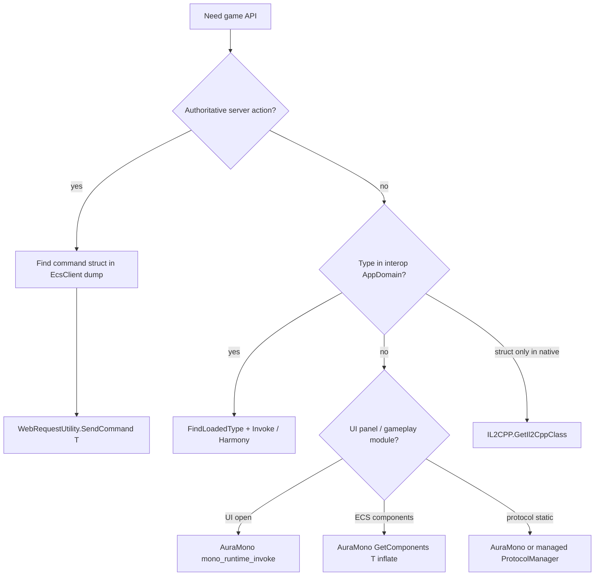

# AGENTS.md — Heartopia Helper

Guide for AI agents and developers working on this mod. Read this file first, then follow links into `docs/` for depth.

---

## 1. What this project is

| Item | Value |
|------|--------|
| Product | Automation / utility mod for **Heartopia** (Unity, hybrid **IL2CPP + embedded Mono**) |
| Output | Single assembly **`helper.dll`** |
| Loaders | **MelonLoader** or **BepInEx IL2CPP** — one per build, never both in-game |
| Core code | `partial class HeartopiaComplete` split across `buddy/*.cs` (~60k lines in main file) |
| Game access | Reflection, Harmony, `WebRequestUtility.SendCommand`, IL2CPP native API, **AuraMono** (`mono_runtime_invoke`) |
| Hard rule | **No RVA / offset patching** — resolve types and methods at runtime |

---

## 2. Documentation map (read in this order)

| When you need… | Read |
|----------------|------|
| **Orientation (start here)** | This file |
| Game + mod architecture, file map, access channels | [docs/ARCHITECTURE.md](docs/ARCHITECTURE.md) |
| **Type resolution** (`FindLoadedType`, pitfalls, workflows) | [docs/TYPE_RESOLUTION.md](docs/TYPE_RESOLUTION.md) |
| **Services, ECS, `EcsService.TryGet`, DataModule** | [docs/GAME_TYPES_AND_SERVICES.md](docs/GAME_TYPES_AND_SERVICES.md) |
| **Decompilation folders + per-feature game types** | [docs/DECOMPILED_SOURCE_MAP.md](docs/DECOMPILED_SOURCE_MAP.md) |
| Disk paths, interop, Il2CppDumper, tools | [docs/GAME_ASSEMBLIES_AND_TOOLS.md](docs/GAME_ASSEMBLIES_AND_TOOLS.md) |
| Build, deploy, logs, troubleshooting | [docs/BUILD_AND_RUN.md](docs/BUILD_AND_RUN.md) |
| Patches, config, frame loops | [docs/TECHNICAL.md](docs/TECHNICAL.md) |
| User-facing features / menu | [docs/FEATURES.md](docs/FEATURES.md) |
| Inventory / `ItemNetPair` / bag pipelines | [docs/BACKPACK_AND_ITEMS.md](docs/BACKPACK_AND_ITEMS.md) |

**Rule:** Do not guess type names from memory. Copy **full namespaces** from decompilations or interop DLLs for the target game build.

---

## 3. Repository layout

```
Heartopia-Helper/
├── AGENTS.md                 ← you are here
├── README.md
├── docs/                     ← canonical documentation
├── buddy/                    ← all mod source + buddy.csproj
│   ├── HeartopiaComplete.cs  ← core UI, hooks, FindLoadedType, most features
│   ├── AuraFarm.cs           ← partial: aura farm + AuraMono infrastructure
│   ├── *Feature.cs           ← partials: bubble, pets, homeland, daily claims, …
│   ├── *Farm.cs              ← static controllers: fishing, insect, bird
│   ├── MelonLoaderPlugin.cs / BepInExPlugin.cs
│   ├── build-all.bat
│   └── Directory.Build.props.example  → copy to Directory.Build.props (gitignored)
├── ilspy-dumps/              ← offline Mono decompile (gitignored, ~20k .cs)
└── gameassembly-dumps/       ← offline IL2CPP decompile (gitignored)
```

**Not compiled** (on disk but excluded from `buddy.csproj`): legacy `AutoFish*.cs`, `InsectFarm.cs`, research dumps. Do not edit them for shipping features.

---

## 4. Build and deploy (correct commands)

### Prerequisites

1. Heartopia installed with **one** loader; game launched once (generates interop).
2. .NET SDK **6+**, Windows x64.
3. Set game path: copy `buddy/Directory.Build.props.example` → `buddy/Directory.Build.props`:

```xml
<Project>
  <PropertyGroup>
    <HeartopiaDir>C:\path\to\Heartopia</HeartopiaDir>
  </PropertyGroup>
</Project>
```

### Build

```bat
cd buddy
build-all.bat
```

Produces:

```
buddy/bin/MelonLoader/Release/helper.dll
buddy/bin/BepInEx/Release/helper.dll
```

Single loader:

```powershell
dotnet build buddy.csproj -c Release -p:Loader=MelonLoader
dotnet build buddy.csproj -c Release -p:Loader=BepInEx
```

One-off path override:

```powershell
dotnet build buddy.csproj -c Release -p:Loader=BepInEx -p:HeartopiaDir="C:\Games\Heartopia"
```

Shipping build (hides loader console): `-c ReleaseShip`

### Deploy

| Loader | Copy `helper.dll` to |
|--------|-------------------------|
| MelonLoader | `<HeartopiaDir>/Mods/helper.dll` |
| BepInEx | `<HeartopiaDir>/BepInEx/plugins/helper.dll` |

### Verify

- Logs: `MelonLoader/Latest.log` or `BepInEx/LogOutput.log`
- In-game menu: **Insert** (default)
- Config: `%LocalLow%/HelperSettings/Config.xml`

**After game patch:** regenerate loader interop, rebuild mod, re-verify type names in dumps.

---

## 5. Game runtime model (three layers)

```
IL2CPP (GameAssembly.dll)     ← Harmony targets, Il2CppInterop stubs
        ↓
Interop (BepInEx/interop or MelonLoader/Il2CppAssemblies)  ← compile-time refs, FindLoadedType
        ↓
Embedded Mono (mono-2.0-bdwgc.dll, images EcsClient, XDT*)  ← AuraMono for many gameplay paths
```

| Layer | Use for |
|-------|---------|
| **Interop + reflection** | Most `FindLoadedType`, Harmony on Unity/known stubs, `SendCommand` |
| **IL2CPP native** | Types missing from interop (`TryFindIl2CppClass`, `ItemNetPair` v10 path) |
| **AuraMono** | Backpack, aura farm, pets, bubbles, daily claims, UI open via `mono_runtime_invoke` |

Many assemblies load **only after entering a town** — test in-world, not main menu.

---

## 6. Decompilations — which folder to open

| Folder | Runtime | Bodies? | Use for |
|--------|---------|---------|---------|
| **`ilspy-dumps/`** | Embedded **Mono** | Full C# | Gameplay, ECS, protocols, UI, tables — **primary research** |
| **`gameassembly-dumps/`** | **IL2CPP** | Stubs + RVA only | `GameApp`, launcher, bootstrap, native layout |
| **`<Game>/BepInEx/interop/*.dll`** | Live interop | Stubs | Exact names `FindLoadedType` sees at runtime |

### Decision table

| Question | Open |
|----------|------|
| `ResourceProtocolManager`, `Entities`, birds, fishing, gather | `ilspy-dumps/XDTLevelAndEntity`, `XDTDataAndProtocol` |
| `ItemNetPair`, task commands, `TableData` | `ilspy-dumps/EcsClient` |
| `BackPackSystem`, `BattlePassSystem` | `ilspy-dumps/XDTGameSystem` |
| UI panel openers, shops | `ilspy-dumps/XDTGameUI` |
| `EcsService`, `ClientSystem.*` services | `ilspy-dumps/EcsSystem`, `XDTDataAndProtocol` |
| `GameApp`, session, hotfix | `gameassembly-dumps/` |
| What name works in mod at runtime | Loader **interop** folder first, then confirm in Mono dump |

**Path pattern (Mono):**

```
ilspy-dumps/<AssemblyRoot>/<ProjectName>/.../Namespace/ClassName.cs
```

**Do not** copy dump folders into `BepInEx/interop`. **Do not** use `gameassembly-dumps` to look up `EcsClient` / `XDT*` gameplay types — they live in Mono dumps.

### Search tips in decompilations

1. Start from **UI** or **ProtocolManager** that performs the action → copy called types.
2. Search **both** namespace variants: `Gameplay` vs `GamePlay`, `ScriptsRefactory.*` duplicates.
3. For network actions, find the **command struct** in `XDT.Scene.Shared.Modules.*` (`EcsClient` image).
4. For ECS state, find **component** under `XDTLevelAndEntity.Gameplay.Component.*`.
5. Cross-check [DECOMPILED_SOURCE_MAP.md](docs/DECOMPILED_SOURCE_MAP.md) matrix (feature → types → mod file).

If `ilspy-dumps/` is missing locally: generate from `%LocalLow%/HelperSettings/MonoDump/` or game `DotnetAssemblies` — see [GAME_ASSEMBLIES_AND_TOOLS.md](docs/GAME_ASSEMBLIES_AND_TOOLS.md).

---

## 7. Type resolution (critical)

### Core API

**`HeartopiaComplete.FindLoadedType(params string[] names)`** — first match across `AppDomain`, with 30 s miss cache.

Always pass **multiple aliases**:

```csharp
this.FindLoadedType(
    "XDTLevelAndEntity.Gameplay.Component.Bubble.BubbleComponent",
    "XDTLevelAndEntity.GamePlay.Component.Bubble.BubbleComponent",
    "Il2CppXDTLevelAndEntity.Gameplay.Component.Bubble.BubbleComponent",
    "BubbleComponent");
```

Related helpers:

| Helper | When |
|--------|------|
| `FindLoadedTypeBySuffix` | Namespace drift between patches |
| `FindEntitiesRuntimeType` | Disambiguate short name `Entities` by method shape |
| `FindTypeByName` / `FindTypeBySignature` | Aura Farm assembly filtering |
| `FindAuraMonoClassByFullName` | Type not in interop — AuraMono class `IntPtr` |
| `TryFindIl2CppClass` | No managed stub at all |

Full detail: [TYPE_RESOLUTION.md](docs/TYPE_RESOLUTION.md).

### Choosing an access path



| Pattern | Examples |
|---------|----------|
| **SendCommand** | Bird photo, bubbles, backpack move, task submit, farm commands |
| **ProtocolManager static invoke** | `ResourceProtocolManager.SendHitStoneCommand`, `MailProtocolManager.*` |
| **EcsService.TryGet&lt;T&gt;** (AuraMono inflate) | Daily claims services |
| **DataModule&lt;T&gt;.Instance** (AuraMono) | `BattlePassSystem`, `BackPackSystem` reads |
| **Harmony** | Movement, `SendCommand` prefix rewrite, input patches |
| **GameObject scan** | Radar, meteor props `p_rock_meteorite*`, player `p_player_skeleton(Clone)` |

### Aura Farm specifics

- Discovery: **AxeChecker** (`HandholdCylinderChecker.PhysicalSelect`) → level object `ownerNetId`.
- Commands: bush/tree/stone via protocol managers; **meteor** uses `SendHitStoneCommand(**parent**NetId)` after resolving view → logic parent (`CollectableMeteorite*`, `MeteoriteLogic`).
- Entity lookup: prefer **`Entities.GetEntity`**, not `EntityUtil.GetEntity`, for meteor parent walks.
- Mono field reads: never unbox reference-type members (`*Entity`) as scalars — use `TryGetAuraMonoEntityNetId`.

See [FEATURES.md § Aura Farm](docs/FEATURES.md), [TECHNICAL.md § Aura Farm](docs/TECHNICAL.md).

---

## 8. Finding objects and live instances

| Goal | Approach | Notes |
|------|----------|-------|
| ECS entity by `netId` | `Entities.GetEntity` / `GetAnyEntity` (managed or AuraMono) | Preferred for components |
| All components of type T | `Entities.GetComponents<T>` | Managed if available; else AuraMono generic inflate ([TYPE_RESOLUTION.md](docs/TYPE_RESOLUTION.md)) |
| Sphere / cylinder overlap | `Entities.SphereQueryEntities`, interact cylinders | Aura farm; shape validation required |
| Interact targets | `InteractSystem` select priority / `SelectPriorityInfo.shape` | Aura farm primary path |
| Level object owner | `EntityHelper.GetLevelObjectOwner`, shape `ownerEntity.netId` | Link UI shape → entity |
| Player position | `GameObject.Find("p_player_skeleton(Clone)")` or host helpers | Fragile on prefab rename |
| World props by name | `GameObject.FindObjectsOfType` + name prefix | e.g. radar, meteor rocks |
| Backpack items | `BackPackSystem.GetAllItem(EStorageType)` | AuraMono or managed — [BACKPACK_AND_ITEMS.md](docs/BACKPACK_AND_ITEMS.md) |
| Service singleton | `EcsService.TryGet<IService>` | AuraMono inflate, not `Managers._serviceDic` |
| UI panel instance | `UIManager.GetView<T>` / `OpenView` | Usually **AuraMono** for `XDTGame.UI.*` |

**Worked example — meteor (aura farm):**

1. Scene: `p_rock_meteorite*` positions classify live rocks.
2. AxeChecker registers **view** `ownerNetId` on level object shape.
3. Resolve **parent** logic `netId` via component scan / `DataCenter.TryGetComponentData`.
4. `SendHitStoneCommand(parentNetId)` with axe equipped.

---

## 9. Mod source conventions

### File placement

| Change type | Where |
|-------------|--------|
| New menu / small feature | New `*Feature.cs` `partial class HeartopiaComplete` |
| Large farm loop | `*Farm.cs` static class + tick from `HeartopiaComplete.OnUpdate` |
| Aura / Mono shared infra | `AuraFarm.cs` (already hosts `EnsureAuraMonoApiReady`, exports) |
| Harmony patch | Dedicated `*Patch.cs` or feature file |

### Code style (project)

- Match surrounding naming and patterns; minimal diff scope.
- Cache resolved `Type` / `MethodInfo` / `IntPtr` — do not scan assemblies every frame.
- Log failures **once** (`ModLogger.Msg`); use `MasterLog*` flags in `HeartopiaComplete.cs` for verbose traces (default `false`).
- `AllowUnsafeBlocks` is on — AuraMono paths use `unsafe` and pointers; follow existing `ref`/`out` pointer patterns ([TYPE_RESOLUTION.md § gotchas](docs/TYPE_RESOLUTION.md)).

### Compiled vs orphan

Only files listed in `buddy/buddy.csproj` `<Compile Include="...">` ship. Adding a new `.cs` requires a csproj entry.

---

## 10. Workflow: add or fix a feature

1. **Decompile** — find UI / manager / command in `ilspy-dumps/`; note assembly image.
2. **List type aliases** — full name, `Gameplay`/`GamePlay`, `Il2Cpp` prefix, `ScriptsRefactory`, short name.
3. **Pick access channel** — SendCommand vs Invoke vs AuraMono vs Harmony (§7).
4. **Implement resolver** — reuse existing helpers; add shape check if short name collides.
5. **Gate on readiness** — retry in `Update` after world load; separate managed vs AuraMono ready flags.
6. **Build both loaders** — `build-all.bat`.
7. **Test in private town** — verify logs, no native crash (Mono generic/ref mistakes crash the process).
8. **Update docs** — `DECOMPILED_SOURCE_MAP.md` matrix row + `FEATURES.md` if user-visible.

---

## 11. Debugging

| Symptom | Action |
|---------|--------|
| `type unavailable` / `null` | [TYPE_RESOLUTION.md](docs/TYPE_RESOLUTION.md) pitfalls; enter town; check interop folder |
| Harmony `[ERR]` | Game update broke signature — re-dump, fix patch target |
| Silent crash | Last AuraMono breadcrumb; check generic `method_inst` and `ref` args |
| Feature idle | `MasterLog*` flag + rebuild; read `auraLastError` / feature status fields |
| Wrong behavior, no error | Wrong type patched — add shape validation |

Log locations: [BUILD_AND_RUN.md](docs/BUILD_AND_RUN.md).

---

## 12. Anti-patterns (do not)

| Do not | Why |
|--------|-----|
| Guess namespaces | Builds differ; use dumps |
| Use `gameassembly-dumps` for `XDT*` gameplay | Wrong runtime — use `ilspy-dumps` |
| Harmony on `FindLoadedType("XDTGame.UI.*")` | UI types often AuraMono-only |
| Mono thunk hook on IL2CPP UI openers | Hook never fires in-game |
| `EntityUtil.GetEntity` for meteor parents | Prefer `Entities.GetEntity` |
| Unbox `*Entity` fields as `uint` | Native crash (`mono_object_unbox`) |
| Edit orphan `.cs` not in csproj | Won't ship |
| Install MelonLoader + BepInEx together | Unsupported |
| Commit `Directory.Build.props` | Machine-specific path |

---

## 13. Quick reference — high-traffic game types

| Purpose | Types (verify in dump for your build) |
|---------|----------------------------------------|
| Network send | `WebRequestUtility`, `ChannelType`, `*NetworkCommand` |
| Gather / aura | `ResourceProtocolManager`, `InteractSystem`, `HandholdCylinderChecker`, `EntityHelper`, `Entities` |
| Meteor | `CollectableMeteoriteViewComponent`, `MeteoriteLogic`, `p_rock_meteorite*` |
| Backpack | `BackPackSystem`, `BackpackProtocolManager`, `ItemNetPair`, `EStorageType` |
| Services | `EcsService`, `IOperationActivityCenterService`, `ClientSystem.*` |
| Tables | `TableData`, `Table*` rows |
| Fishing | `HandHoldFishingRod`, fish shadow components |
| Birds | `TakingBirdPhotoCommand`, `BirdScannableComponent` |

Full matrix: [DECOMPILED_SOURCE_MAP.md § 4](docs/DECOMPILED_SOURCE_MAP.md).

---

## 14. Related entry points in code

| File | Responsibility |
|------|----------------|
| `HeartopiaComplete.cs` | `FindLoadedType`, UI, most features, `OnUpdate` |
| `AuraFarm.cs` | Aura farm, AuraMono exports, mono class/method resolve |
| `BubbleFeature.cs` | SendCommand patch, mono native hooks pattern |
| `HomelandFarmFeature.cs` | Managed + AuraMono `GetComponents<T>` reference |
| `DailyClaimsFeature.cs` | `EcsService.TryGet<T>` AuraMono inflation reference |
| `DailyQuestSubmitFeature.cs` | `ItemNetPair` list construction |
| `WildAnimalGiftFeature.cs` | AuraMono-only feature (no `FindLoadedType`) |

---

*Last aligned with repo docs and aura meteor pipeline. After major game patches, re-read [TYPE_RESOLUTION.md](docs/TYPE_RESOLUTION.md) and regenerate dumps.*
