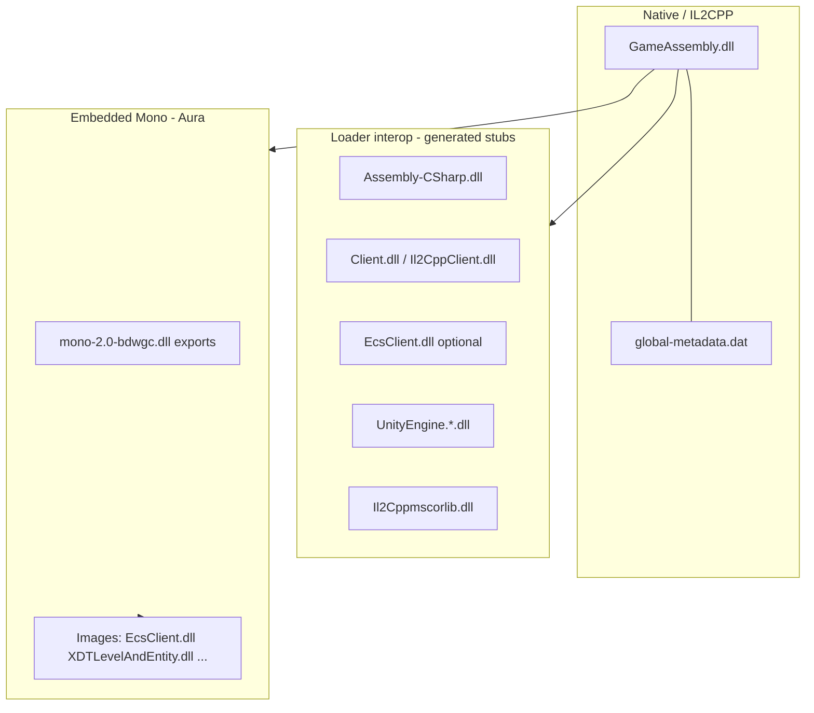
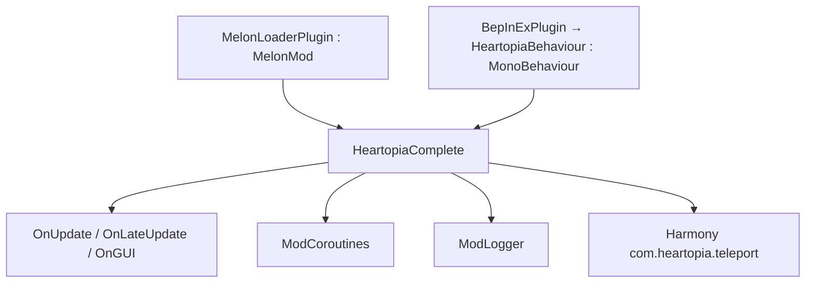
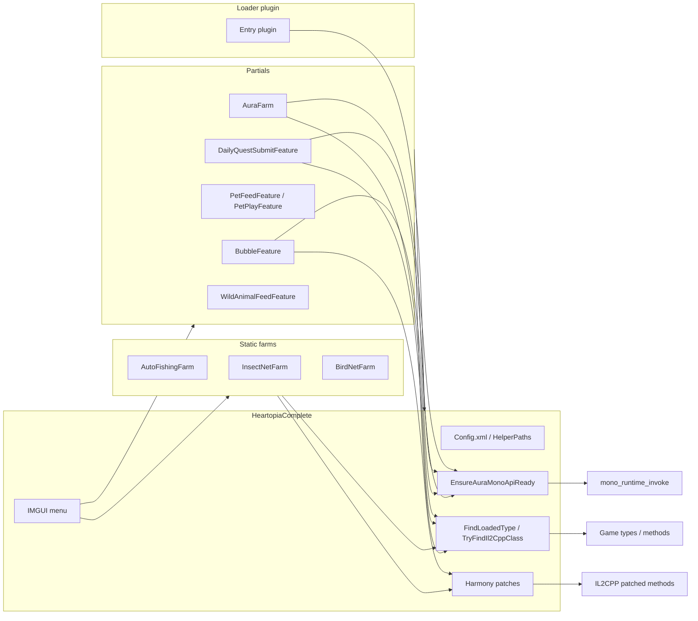

# Architecture Reference (Game + Mod)

Master orientation document for **Heartopia Helper**. Use this when adding features, fixing type resolution after patches, or navigating `ilspy-dumps/` and `buddy/`.

Specialized docs (still valid, linked from here):

| Document | Focus |
|----------|--------|
| [../AGENTS.md](../AGENTS.md) | **Agent onboarding** — where to start, build, type resolution, dump workflow |
| [DECOMPILED_SOURCE_MAP.md](./DECOMPILED_SOURCE_MAP.md) | **`ilspy-dumps/` + `gameassembly-dumps/` navigation + every game type the mod touches** |
| [TECHNICAL.md](./TECHNICAL.md) | Patches, config schema, frame loops |
| [TYPE_RESOLUTION.md](./TYPE_RESOLUTION.md) | `FindLoadedType`, SendCommand, pitfalls |
| [GAME_ASSEMBLIES_AND_TOOLS.md](./GAME_ASSEMBLIES_AND_TOOLS.md) | Disk paths, interop generation, tools |
| [BACKPACK_AND_ITEMS.md](./BACKPACK_AND_ITEMS.md) | Inventory pipelines |
| [FEATURES.md](./FEATURES.md) | Menu / user-facing features |
| [BUILD_AND_RUN.md](./BUILD_AND_RUN.md) | Build and deploy |

---

## 1. Executive summary

Heartopia is a **hybrid IL2CPP + embedded Mono** Unity game. The mod is a **single `helper.dll`** loaded by **MelonLoader** or **BepInEx IL2CPP** (one loader per build). Almost all logic lives in one partial class `HeartopiaComplete` (~58k lines) split across feature files; farms are static controllers ticked from `OnUpdate`.

The mod talks to the game through **four access channels**:

| Channel | When used | Stability |
|---------|-----------|-----------|
| **Compile-time interop** | Unity APIs, Harmony patch targets | High for Unity; partial for game |
| **Runtime reflection** (`FindLoadedType`) | Most game systems after assemblies load | Medium — names drift on patches |
| **IL2CPP native API** (`IL2CPP.*`, `TryFindIl2CppClass`) | When interop DLL missing (e.g. `EcsClient.dll`) | Medium — needs in-world load |
| **AuraMono** (`mono_runtime_invoke`) | Backpack, aura farm, pets, bubbles, daily quests | Medium — timing-sensitive |

There is **no RVA/offset patching**. Everything is managed reflection, Harmony, Win32 input, or Mono exports.

---

## 2. Game client architecture

### 2.1 Three runtime layers



| Layer | Physical location | Role |
|-------|-------------------|------|
| **IL2CPP** | `<Game>/GameAssembly.dll`, `xdt_Data/il2cpp_data/Metadata/global-metadata.dat` | Bootstrap, engine, launcher; Harmony targets at runtime |
| **Interop stubs** | `<Game>/BepInEx/interop/` or `<Game>/MelonLoader/Il2CppAssemblies/` | Managed wrappers (`Il2Cpp*`) for compile-time references and `AppDomain` reflection |
| **Embedded Mono** | Game ships Mono module; logical images mirror `EcsClient`, `XDTLevelAndEntity`, etc. | Parallel managed universe accessed via `mono_class_from_name` / `mono_runtime_invoke` |

**Important:** Interop assemblies are **not a full export** of the game. Many types exist only in native IL2CPP or only in Mono until resolved at runtime. Offline research uses two dump trees: **`ilspy-dumps/`** (Mono, full C# bodies) and **`gameassembly-dumps/`** (IL2CPP, signatures + RVAs). Interop describes the **IL2CPP-side** naming at runtime (`Il2Cpp` prefix on `FullName`).

### 2.2 Logical module map (game assemblies)

Repo decompilation lives in `ilspy-dumps/` (gitignored locally; ~20k+ `.cs` files). Top-level assembly folders:

| Folder | ~`.cs` count | Primary responsibility |
|--------|-------------|------------------------|
| **EcsClient** | 8170 | ECS shared data, network command structs, `TableData`, `ItemNetPair`, static tables |
| **XDTLevelAndEntity** | 3602 | World entities, components, interact, fishing, gather, birds |
| **XDTDataAndProtocol** | 2209 | Protocol managers, `WebRequestUtility`, events, component data |
| **XDTGameUI** | 3735 | UI panels, HUD, scanner status, pet play UI |
| **XDTGameSystem** | 910 | Gameplay systems: backpack, pet, wild animal, levels |
| **EcsSystem** | 879 | Client network managers, world/town networking |
| **DnsClient, EngineWrapper, MonoShared, ScriptBridge, XDTBaseService, XDTViewBase, Plugins, MsgPackFormatters, MonoUniTask** | smaller | Infrastructure, networking, rendering bridge |

### 2.2.1 Namespace conventions (search these in ILSpy)

| Prefix | Typical contents | Example types |
|--------|------------------|---------------|
| `XDT.Scene.Shared.Modules.*` | Cross-client/server ECS modules | `Backpack.ItemNetPair`, `Animal.AnimalGroup`, network commands |
| `XDTLevelAndEntity.*` | Level entity components & systems | `Entities`, `InteractSystem`, `HandHoldFishingRod` |
| `XDTDataAndProtocol.ProtocolService.*` | Client protocol facades | `WebRequestUtility`, `ResourceProtocolManager`, `TaskProtocolManager` |
| `XDTGameSystem.GameplaySystem.*` | Singleton gameplay modules | `BackPack.BackPackSystem`, `Pet.PetSystem`, `WildAnimal.WildAnimalSystem` |
| `XDTGame.*` / `XDTGameUI` | UI | `ScannerStatusPanel`, `CatPlayStatusPanel` |
| `EcsClient.*` | Table/config wrappers on shared data | `TableData`, `EStorageType` |
| `ScriptsRefactory.*` | Refactored duplicates of level/entity types | `BirdScannableComponent`, `LevelObjectManager` |
| `XD.GameGerm.*` / `EcsSystem.*` | Networking core | `ClientNetworkManager`, `ChannelType` |

**Typo variant:** some builds use `GamePlay` vs `Gameplay` in namespaces — the mod passes **both** to `FindLoadedType`.

### 2.3 Core game subsystems (how the game is structured)

#### ECS / entities (`XDTLevelAndEntity`)

Central hub: **`Entities`** (`XDTLevelAndEntity.BaseSystem.EntitiesManager.Entities`).

- Static/sealed service for creating, querying, and destroying level entities.
- Implements physics query interfaces, VFX, level object client service.
- Used by components (fishing rod, gatherables, birds) and by the mod for `GetComponents`, `SphereQueryEntities`, VFX.

Folder layout under `ilspy-dumps/XDTLevelAndEntity/XDTLevelAndEntity/`:

```
BaseSystem/          # Entities, InteractSystem, Homeland, ...
Core/                # World, entity core
EntityView/          # View layer
Game/                # Game modes, modules
Gameplay/            # Components (Fish, Gather, Equip, Player, Bubble, ...)
GameplaySystem/      # Crafting, etc.
GameScenes/          # Scene-specific logic
ResHandle/           # Resource handles (animation, interact)
Utils/               # EntityHelper, EntityUtil, ...
```

**`InteractSystem`** (`BaseSystem.InteractSystem.InteractSystem`):

- `ViewModule` on the entity base system.
- Maintains selected interact targets, priority (`SelectPriorityInfo`), command lists.
- Drives player F-key / tool interactions.
- Mod aura farm reads interact targets and issues protocol commands when in range.

**Example component — fishing** (`Gameplay.Component.Fish.HandHoldFishingRod`):

- Extends `EquipHandhold`.
- Creates float entity via `Entities.CreateEntity`, manages hook state, fish line, `PlayerFishAreaChecker`.
- Mod auto-fish resolves fishing state through host methods on `HeartopiaComplete` (reflection on rod/fish/shadow types), calls `TrySetFishingPressed` rather than simulating Unity `Input`.

#### Gameplay systems (`XDTGameSystem`)

Module pattern: classes like **`BackPackSystem`** extend `DataModule<T>` with `[ModuleScope(typeof(GameLevel_Main))]`.

Key system: **`XDTGameSystem.GameplaySystem.BackPack.BackPackSystem`**

- Owns `_storages` map (`EStorageType` → `StorageBase`).
- `GetAllItem(EStorageType)` — primary inventory enumeration for the mod.
- `CheckSubmitItem` / `CheckSubmitItems` — daily quest item matching.
- Mod uses both **managed reflection** and **AuraMono invoke** on this type (see §5).

Other gameplay modules referenced by the mod:

- `Pet.PetSystem`, `WildAnimal.WildAnimalSystem`
- `GameLevels.*` — level-scoped module loading

#### Protocol / networking (`XDTDataAndProtocol`)

**`WebRequestUtility`** — universal outbound command sender:

```csharp
public static int SendCommand<T>(T command, bool needAuthed = true, ChannelType channelType = ChannelType.Reliable)
    where T : IMessageBase
```

Mod pattern:

1. Resolve command struct type (often in `XDT.Scene.Shared.Modules.*` / `EcsClient`).
2. Resolve `WebRequestUtility` + `ChannelType`.
3. `GetMethods` → static generic `SendCommand` (3 params) → `MakeGenericMethod` → `Invoke`.

Specialized managers (static facades wrapping commands):

| Manager | Mod usage |
|---------|-----------|
| `ResourceProtocolManager` | `SendPickBushCommand`, `SendAttackTree`, `SendHitStone` (aura farm) |
| `TaskProtocolManager` | Daily quest submit |
| `BackpackProtocolManager` | `MoveBatchBackpackItems` |
| `PetProtocolManager` / `MeowProtocolManager` | Pet feed / cat play |
| `WildAnimalProtocolManager` | Wild animal feed / gifts |
| Activity / bubble commands | Bubble spawn (Harmony prefix on `SendCommand` or Mono create) |

#### Static data (`EcsClient` / `TableData`)

**`TableData`** — massive static class (~36k lines decompiled) holding all Excel-driven tables: items, NPCs, fish, birds, tasks, bubbles, etc.

Mod uses `TableData` for:

- NPC teleport lists, item prices, pet breed data, task submit targets
- Resolved via `FindLoadedType("TableData", "EcsClient.TableData")` or **`TryFindIl2CppClass("TableData", "EcsClient", ...)`**
- AuraMono: `TableData.GetGameTask`, price lookups

**`ItemNetPair`** — blittable struct in `XDT.Scene.Shared.Modules.Backpack`:

```csharp
public struct ItemNetPair { public uint NetId; public int Count; }
```

Used in daily quest submit lists. Mod builds `List<ItemNetPair>` via **AuraMono native allocation** when Il2Cpp interop types are unavailable.

#### UI layer (`XDTGameUI`)

IMGUI mod menu is separate; game UI uses Unity uGUI / TMP. Mod interacts via:

- `GameObject.Find("fixed path")` — fragile hierarchy paths
- Reflection on panel types (`ScannerStatusPanel`, backpack UI)
- Harmony postfix on `UnityEngine.UI.Image.set_sprite` for bulk item selector
- Win32 `SendInput` / `PostMessage` for bag automation clicks

#### Networking client (`EcsSystem`)

- `XDTownClientNetworkManager`, `ClientNetworkManager` — resolved for some pet/play paths.
- Underlying transport wired into `WebRequestUtility.SetNetworkClient`.

### 2.4 Game object hierarchy (mod assumptions)

Frequently hard-coded paths (break on major updates):

| Purpose | Typical path / name |
|---------|---------------------|
| Local player | `p_player_skeleton(Clone)` |
| Main camera | `GameApp/startup_root(Clone)/Main Camera` |
| Radar / world | Dynamic scan under internal `radarContainer` GameObject |

Prefer resolving via `Character`, `EntityUtil`, or component queries when possible.

### 2.5 Scene / module lifecycle

1. Login / loading scenes (`GameScene_Login`, `GameScene_Main`, homeland scenes in dumps).
2. Gameplay modules (`BackPackSystem`, etc.) attach when `GameLevel_Main` scope is active — **many types are null in main menu**.
3. Assemblies load progressively; mod uses **miss cache (30s)**, **retry in Update**, and **shape-based disambiguation** (see TYPE_RESOLUTION.md).

---

## 3. Decompiled source map (`ilspy-dumps/` + `gameassembly-dumps/`)

Local folders (both in `.gitignore`):

| Folder | Source | Contents |
|--------|--------|----------|
| **`ilspy-dumps/`** | Mono PE (~20k+ `.cs` files) | `EcsClient`, `XDT*`, protocols — **full method bodies** |
| **`gameassembly-dumps/`** | Il2CppDumper + ilspycmd | `GameApp`, `Client`, Unity IL2CPP — **stubs + RVAs** |
| **`tools/cpp2il_out/`** | Il2CppDumper raw output | `DummyDll`, `dump.cs`, `script.json` |

Regeneration: [GAME_ASSEMBLIES_AND_TOOLS.md](./GAME_ASSEMBLIES_AND_TOOLS.md#gameassembly-decompilation-il2cpp).

Mono layout: **`<AssemblyRoot>/...`** with nested project folders mirroring original namespaces.

### 3.1 Top-level index

```
ilspy-dumps/
├── EcsClient/              # Tables, shared modules, ItemNetPair, command structs
├── XDTLevelAndEntity/        # Entities, components, interact, world
├── XDTDataAndProtocol/       # WebRequestUtility, protocol managers, events
├── XDTGameSystem/            # BackPackSystem, PetSystem, WildAnimalSystem, ...
├── XDTGameUI/                # Panels, HUD
├── EcsSystem/                # Network managers
├── XDTBaseService/           # Texture cache, base services
├── EngineWrapper/            # Engine bridge
├── ScriptBridge/             # Script interop
├── MonoShared/               # Shared Mono utilities
├── Plugins/                  # Plugin assemblies
└── ... (DnsClient, MonoUniTask, MsgPackFormatters, XDTViewBase)
```

### 3.2 XDTLevelAndEntity — where to look

| Path under `XDTLevelAndEntity/XDTLevelAndEntity/` | Contents |
|---------------------------------------------------|----------|
| `BaseSystem/EntitiesManager/Entities.cs` | Entity factory, queries, sphere query |
| `BaseSystem/EntitiesManager/EntityUtil.cs` | Entity lookup helpers |
| `BaseSystem/InteractSystem/InteractSystem.cs` | Target selection, interact commands |
| `Gameplay/Component/Gather/` | `CollectableObjectComponent`, bush components |
| `Gameplay/Component/Fish/` | `HandHoldFishingRod`, float, fish shadow |
| `Gameplay/Component/Bubble/` | Bubble world components |
| `Gameplay/Component/Equip/` | Tools (axe, net, rod) |
| `Gameplay/Component/Player/` | Player movement, fish area checker |
| `Utils/EntityHelper.cs` | Helper queries used by aura farm |

### 3.3 EcsClient — where to look

| Path pattern | Contents |
|--------------|----------|
| `Table*.cs` (flat in root) | Thousands of config rows — search by `TableFish`, `TableBird`, etc. |
| `TableData.cs` | Aggregator + lookup APIs |
| `XDT/Scene/Shared/Modules/` | Shared structs: backpack, animal, pet, build, ... |
| `XDT/Scene/Shared/Modules/Backpack/ItemNetPair.cs` | Quest submit pair struct |
| `EcsClient/` subfolder | Client-specific ECS glue |

### 3.4 XDTDataAndProtocol — where to look

| Path | Contents |
|------|----------|
| `ProtocolService/WebRequestUtility.cs` | SendCommand entry |
| `ProtocolService/Resource/ResourceProtocolManager.cs` | Gather/chop/mine sends |
| `ProtocolService/Task/TaskProtocolManager.cs` | Task / daily submit |
| `ProtocolService/BackPack/BackpackProtocolManager.cs` | Inventory moves |
| `ProtocolService/Pet/`, `WildAnimal/`, `Meow/` | Pet/animal protocols |
| `ComponentsData/` | ECS component serialized data |
| `Events/` | Event bus types |

### 3.5 XDTGameSystem — where to look

| Path | Contents |
|------|----------|
| `GameplaySystem/BackPack/BackPackSystem.cs` | Inventory core |
| `GameplaySystem/Pet/PetSystem.cs` | Pet logic |
| `GameplaySystem/WildAnimal/WildAnimalSystem.cs` | Wild animals |
| `GameLevels/` | Level module scopes |
| `UISystem/BackPack/` | UI item types (`BackpackItem`) |

### 3.6 How to use dumps during development

1. Find type in dump → copy **full namespace** + **assembly name**.
2. Add aliases to `FindLoadedType(...)` including `Il2Cpp` prefix variant.
3. If type is a **network command**, prefer `WebRequestUtility.SendCommand` over direct manager invoke.
4. Compare dump version with game patch / interop regeneration date.
5. Do **not** reference dump DLLs at runtime — use loader interop or AuraMono/IL2CPP paths.

---

## 4. Mod architecture

### 4.1 Build & entry points

| Item | Value |
|------|-------|
| Project | `buddy/buddy.csproj` |
| Output | `buddy/bin/<Loader>/<Configuration>/helper.dll` |
| TFM | `net6.0`, x64, `AllowUnsafeBlocks` |
| Loaders | `MelonLoader` or `BepInEx` via `-p:Loader=` and `#if MELONLOADER` / `BEPINEX` |
| Script | `buddy/build-all.bat` |
| Game path | `buddy/Directory.Build.props` → `HeartopiaDir` |

**Entry flow:**



| File | Role |
|------|------|
| `MelonLoaderPlugin.cs` | Forwards MelonLoader lifecycle to `HeartopiaComplete` |
| `BepInExPlugin.cs` | Creates persistent `HeartopiaBehaviour`; sets `ModCoroutines.SetHost` |
| `HeartopiaComplete.cs` | Main partial class — UI, teleport, radar, config, most game integration |
| `ModLogger.cs` | Loader-agnostic logging |
| `ModCoroutines.cs` | MelonCoroutines vs `MonoBehaviour.StartCoroutine` |
| `HelperPaths.cs` | `%LocalLow%/HelperSettings/` via known folder GUID |

`HeartopiaComplete` is **not** a MelonMod — plain class with explicit lifecycle methods.

### 4.2 Partial class composition

All merge into `public partial class HeartopiaComplete`:

| File | ~Lines | Responsibility |
|------|--------|----------------|
| `HeartopiaComplete.cs` | 66958 | Core: UI, config, teleport, radar, net cook, auto sell, fishing helpers, type resolution, IL2CPP/AuraMono infrastructure |
| `HomelandFarmFeature.cs` | 20045 | Homeland farm: radius water/weed/harvest/fertilize, sow, AuraMono `GetComponents<T>` discovery |
| `AuraFarm.cs` | 7435 | Aura gather/chop/mine, Mono API exports, resource protocol |
| `PetFeedFeature.cs` | 4530 | Feed all pets, UI textures, AuraMono pet APIs |
| `DailyClaimsFeature.cs` | 2719 | Daily activity / guides / mail / battle-pass claims |
| `WildAnimalFeedFeature.cs` | 2573 | Trough feeding, table lookups |
| `PuzzleNetFeature.cs` | 2265 | Puzzle solver automation |
| `PetPlayFeature.cs` | 2188 | Cat play / dog train automation |
| `ShopDumpFeature.cs` | 1996 | Store dump tooling |
| `SnowSculptureFeature.cs` | 1584 | Auto snow sculpting |
| `DailyQuestSubmitFeature.cs` | 1467 | CanSubmit daily orders, ItemNetPair lists |
| `FaceShopBuyAllFeature.cs` | 1359 | Face shop buy-all |
| `PicturesDecryptFeature.cs` | 1322 | ScreenCapture pictures decrypt/browse |
| `ShopBuyAllFeature.cs` | 1197 | Clothing shop buy-all |
| `BubbleFeature.cs` | 1164 | Bubble radar, spawn, SendCommand Harmony |
| `PadBuildHotkeyFeature.cs` | 913 | Pad build hotkeys (confirm/cancel/rotate/move/delete); 3-tier `BuildModule` resolve: managed → AuraMono `Managers.GetModule(Type)` → UI clicks |
| `NoclipFeature.cs` | 883 | Noclip movement (incl. vehicle) |
| `ItemDumpFeature.cs` | 863 | Item table dump tooling |
| `WildAnimalGiftFeature.cs` | ~700 | Claim wild animal gifts (AuraMono entity scan) |
| `DrawUploadFeature.cs` | 588 | Drawing-board upload (server-authoritative pixel ops) |
| `HeartopiaResourceVisualEsp.cs` | 587 | On-screen resource ESP |
| `BirdPhotoSubmitFeature.cs` | 504 | Bird photo submit helper |
| `ShopQuickBuyFeature.cs` | 441 | Shop quick-buy |
| `InstrumentHotkeyGuardFeature.cs` | 428 | Blocks mod hotkeys while an instrument panel is open (throttled `GetView` poll) |
| `HeartopiaDebugEsp.cs` | 319 | Internal debug overlays |
| `BunnyHopFeature.cs` | small | Jump via AuraMono player state |
| `HideJumpButtonFeature.cs` | small | UI tweak |
| `LodSettingsFeature.cs` | small | LOD override |
| `AnimalCareFeature.cs` | small | New Features tab wiring |

**Static farm modules** (separate classes, not partial):

| File | ~Lines | Tick |
|------|--------|------|
| `AutoFishingFarm.cs` | 957 | `AutoFishingFarm.Update(host)` from `OnUpdate` |
| `InsectNetFarm.cs` | 658 | `InsectNetFarm.Update(host)` |
| `BirdNetFarm.cs` | 959 | `BirdNetFarm.Update(host)` |

**Harmony patch files** (standalone static patch classes):

- Movement (installed lazily on first feature use, not at startup): `TransformPositionPatch`, `CharacterControllerPatch`, `TransformRotationPatch`, `CharacterRotationPatch`
- Input (installed lazily): `InputGetKey*Patch.cs` (6 files) — simulated F-key for resource farm / interact helpers

**Standalone utility:**

- `BubbleMonoNativeHook.cs` — x64 detour for Mono method thunks (bubble create)
- `LocalizationManager.cs` — i18n
- `WarehouseBypassFeature.cs` — static helper called from `OnUpdate`
- `DrawColorCodec.cs` — drawing-board color LUT codec (static helper)
- `MonoAssemblyDump.cs` — embedded-Mono assembly dump tooling
- `HelperPaths.cs` — config/data path resolution

### 4.3 Lifecycle sequence

**`OnInitializeMelon`:**

1. Console visibility (BepInEx ship build).
2. `Harmony("com.heartopia.teleport")`.
3. Load config: localization, radar icons, teleports, keybinds, theme, patrols, bird farm.
4. Patch: `CharacterController.Move`, `Transform.position/rotation`, Input GetKey* (6 patches).
5. Start `NetCookCoroutineWarmupRoutine`.
6. `InitializeBubbleFeature()`.

**`OnUpdate`** (excerpt — order matters for side effects):

- Dynamic patch ensure: bird photo probe, net cook, pet play, stranger chat bypass
- `WarehouseBypassFeature.Update`
- Bag automation rescan, pet play, game UI block, mouse look
- FPS bypass, LOD, hide jump, bunny hop, bubble feature
- Teleport/noclip sync, auto repair toast scan
- Farm ticks: `AutoFishingFarm`, `InsectNetFarm`, `BirdNetFarm`, `UpdateAuraFarm`
- Radar refresh, bag/warehouse automation state machines

**`OnLateUpdate`:** mouse-look camera, position monitor, camera override, custom FOV.

**`OnGUI`:** full mod menu (IMGUI), radar overlay, resource ESP, notifications.

### 4.4 Component interaction diagram



**Dependency rules:**

- Farms **never** reference each other; they call **`HeartopiaComplete` host methods** for game access (equip tool, send commands, scan entities).
- Features as partials access **private host state** directly (shared caches, config fields).
- **`AuraFarm.cs`** owns Mono export delegates; other partials call `EnsureAuraMonoApiReady()` defined there.
- **Config** is centralized in `UnifiedConfigData` → `%LocalLow%/HelperSettings/Config.xml`.

### 4.5 Movement & teleport model

Static flags on `HeartopiaComplete`:

- `OverridePlayerPosition`, `OverridePosition`, `teleportFramesRemaining`
- `OverrideCameraPosition`, camera override frame counter
- `OverridePlayerRotation` for forced facing

Flow: set transform + override flag → `CharacterControllerPatch` steers `Move` toward override → prevents controller snap-back. Noclip continuously updates override from WASD in `OnUpdate`.

### 4.6 Config & user data

| Path | Content |
|------|---------|
| `%LocalLow%/HelperSettings/Config.xml` | Unified XML config (keybinds, theme, radar, patrols, bird farm) |
| `%LocalLow%/HelperSettings/Cache/` | Radar species icon index |
| `%LocalLow%/HelperSettings/MonoDump/` | Optional Mono PE dumps for ILSpy (dev only) |
| `{Game}/UserData/helper.log` | BepInEx mod log append |

Legacy JSON files migrated once via `HelperPaths.TryMigrateLegacyUserData`.

---

## 5. Type access matrix (interop vs reflection vs AuraMono vs IL2CPP)

### 5.1 Channel definitions

| Channel | Mechanism | Types visible |
|---------|-----------|---------------|
| **A. Compile-time interop** | References in `buddy.csproj` to loader-generated DLLs | Unity engine, subset of game assemblies |
| **B. Runtime reflection** | `FindLoadedType`, `MethodInfo.Invoke`, `Activator.CreateInstance` | Any type loaded in `AppDomain` after game boot |
| **C. IL2CPP native** | `IL2CPP.il2cpp_*`, `TryFindIl2CppClass`, `IL2CPP.GetIl2CppClass` | Native metadata classes even without interop DLL |
| **D. AuraMono** | `mono_class_from_name`, `mono_runtime_invoke`, `FindAuraMonoImage("EcsClient")` | Mono image types parallel to EcsClient/XDT* modules |

### 5.2 What compile-time interop gives (`buddy.csproj`)

Always referenced (both loaders):

| Reference | Direct mod usage |
|-----------|------------------|
| `UnityEngine`, `UnityEngine.*Module` | `GameObject`, `Transform`, `CharacterController`, `Input`, `Camera`, `Time`, IMGUI |
| `UnityEngine.UI`, `Unity.TextMeshPro` | Bulk selector sprite patch, UI automation |
| `Il2CppInterop.Runtime` | `Il2CppSystem.*`, `IL2CPP` P/Invoke, `WrapToIl2Cpp()` for BepInEx coroutines |
| `Assembly-CSharp` | General game stubs (partial) |
| `Client` / `Il2CppClient` | Client assembly stubs |
| `Il2Cppmscorlib` | Il2Cpp `List<>`, primitive interop |
| `0Harmony`, loader core | Patching |

Conditionally referenced (`Exists(...)`):

| Reference | When present |
|-----------|--------------|
| `EcsClient` | Extra command/table types for compile-time (still often resolved at runtime) |

**Practical rule:** interop is used **directly** mainly for **Unity types** and Harmony patch signatures. Game domain types are referenced at compile time only occasionally — almost all game logic uses channel B/C/D.

### 5.3 Runtime reflection — primary type catalog

Resolved via `FindLoadedType` / `FindLoadedTypeBySuffix` / shape scans:

| Domain | Types (canonical names) |
|--------|-------------------------|
| **Network core** | `XDTDataAndProtocol.ProtocolService.WebRequestUtility`, `XD.GameGerm.Network.ChannelType` |
| **ECS query** | `XDTLevelAndEntity.BaseSystem.EntitiesManager.Entities`, `EntityUtil`, `EntityHelper` |
| **Interact / aura (managed path)** | `InteractSystem`, `ResourceProtocolManager`, `SelectPriorityInfo`, gather components |
| **Fishing** | `GameplayApi`, `FishingSubState`, `HandHoldFishingRod` (via host helpers), fish shadow components |
| **Birds** | `BirdScannableComponent`, `BirdWatchingManager`, `TakingBirdPhotoCommand`, `ScannerStatusPanel` |
| **Bubbles** | `BubbleComponent`, `BubbleMoveComponent`, `CreateBubbleNetworkCommand`, `IBubbleService` |
| **Inventory** | `BackPackSystem`, `BackpackProtocolManager`, `BackpackItem`, `EStorageType` |
| **Tasks** | `TaskProtocolManager`, submit command structs |
| **Pets** | `PetSystem`, `PetProtocolManager`, `MeowProtocolManager`, cat/dog UI panels |
| **Wild animals** | `WildAnimalSystem`, `WildAnimalProtocolManager`, `AnimalProtocolManager`, `AnimalUtil`, `AnimalGroup` |
| **Tables** | `TableData` |
| **Cooking** | `PrepareCookingNetworkCommand`, cooking protocol types |
| **Player** | `Character`, `GamePhotoMode` |
| **Network managers** | `XDTownClientNetworkManager`, `ClientNetworkManager` |
| **UI services** | `LocalTextureCacheUtility`, `ImageEnum` |

Features with heavy `FindLoadedType` usage: core (`HeartopiaComplete`), `BubbleFeature`, `PetFeedFeature`, `PetPlayFeature`, `WildAnimalFeedFeature`, `PuzzleNetFeature`, `DailyQuestSubmitFeature` (fallback), `BirdNetFarm` (via host). **`WildAnimalGiftFeature` uses AuraMono only** (no `FindLoadedType`).

### 5.4 IL2CPP native — when and what

Used when **`EcsClient.dll` interop is missing** or generic `List<ItemNetPair>` cannot be bound safely.

| API location | Types / purpose |
|--------------|-----------------|
| `TryFindIl2CppClass` in `HeartopiaComplete` | `TableData`, table row access for auto sell / NPC / teleport |
| `IL2CPP.GetIl2CppClass("EcsClient.dll", "XDT.Scene.Shared.Modules.Backpack", "ItemNetPair")` | Daily quest submit v10 direct path |
| `il2cpp_domain_get_assemblies` + name scan | Fallback class discovery |

**Prefer reflection first**; fall back to IL2CPP when interop assembly not generated.

### 5.5 AuraMono — exclusive or primary paths

`EnsureAuraMonoApiReady()` loads exports from `mono-2.0-bdwgc.dll` (or game-bundled Mono). **`AttachAuraMonoThread()`** required before invoke.

| Type / method | Feature | Notes |
|-------------|---------|-------|
| `ResourceProtocolManager.SendPickBushCommand` / tree / stone | AuraFarm | Fallback when managed `MethodInfo` null |
| `BackPackSystem.GetAllItem` | Bag tab, auto sell, daily quest, wild feed | Collection walk via `TryEnumerateAuraMonoCollectionItems` |
| `BackPackSystem.CheckSubmitItem(s)` | DailyQuestSubmitFeature | Cheapest pair builder |
| `TaskProtocolManager.ClientSubmitNpcTaskItem` | DailyQuestSubmitFeature | Native list of `ItemNetPair` |
| `List<ItemNetPair>` construction | DailyQuestSubmitFeature | **Does not** use `mono_class_bind_generic_parameters` (crashes) — manual list class lookup |
| `CookingSystem` / prepare cook | Net cook (HeartopiaComplete) | Some builds |
| `PetSystem` / feed APIs | PetFeedFeature | `List<uint>` via Mono when Il2Cpp list fails |
| `WildAnimalSystem` | WildAnimalFeedFeature | Feed trough |
| `WildAnimalProtocolManager.HaveGift` / `HaveGift(EcsEntity)` | WildAnimalGiftFeature | Pending groups + animal gift filter |
| `AnimalUtil.IsGiftBox` / `GetGroup` | WildAnimalGiftFeature | Gift box entity scan |
| `AnimalProtocolManager.GetNetworkEntity` / `TakeGift` | WildAnimalGiftFeature | Resolve ECS entity + claim command |
| `ActivityEventProtocolManager.Create*` | BubbleFeature | Native hook + mono invoke |
| `Player` move / jump methods | BunnyHopFeature | `OnJumpButton`, `SetJumpInput` pulse |
| `TableData.GetGameTask` | DailyQuestSubmitFeature | Task metadata |

**Aura assembly filtering** (`AuraFarm.cs`): prefer `Assembly-CSharp`, `Il2CppAssembly-CSharp`, `XDT`, `Game`; exclude Unity/System/Harmony/MelonLoader.

### 5.6 Feature → access channel quick reference

| Feature | Primary | Fallback |
|---------|---------|----------|
| Noclip / teleport | Interop Harmony on Unity types | — |
| Aura farm (gather/chop/mine) | AuraMono protocol invoke | Managed `ResourceProtocolManager` reflection |
| Auto fishing | Reflection on fishing components + host API | — |
| Insect / bird farms | Reflection + SendCommand / host scans | Bird photo runtime probe patch |
| Bubble spawn / radar | Harmony on `SendCommand` + reflection | AuraMono create bubble |
| Radar / ESP | `GameObject` scan + reflection components | — |
| Bag / warehouse | AuraMono `GetAllItem` | Managed `BackPackSystem` |
| Daily quest submit | AuraMono submit + native `ItemNetPair` list | IL2CPP `ItemNetPair`, managed reflection |
| Auto sell | Managed + AuraMono + optional IL2CPP TableData | — |
| Pet feed / play | AuraMono + reflection on protocols/UI | — |
| Wild animal feed | AuraMono + reflection (`WildAnimalFeedFeature`) | Managed `BackPackSystem` |
| Wild animal gifts | AuraMono only (`WildAnimalGiftFeature`) | — (no interop / level scan) |
| Net cook | SendCommand + Harmony registration patch | AuraMono CookingSystem |
| Puzzle solver | Reflection on puzzle types | — |
| NPC teleport / tables | `TableData` reflection / IL2CPP / AuraMono | — |
| Bulk item selector | Harmony on `Image.set_sprite` (interop UI) | Direct `GetAllItem` for bag tab |
| Bunny hop | AuraMono player/move components | — |

### 5.7 Integration patterns (after type resolved)

1. **Harmony** — movement, transforms, SendCommand prefix, net cook registration, bird photo probe, building bypass (dynamic).
2. **SendCommand** — any authoritative server action (bird photo, bubble, tasks, backpack moves).
3. **MethodInfo.Invoke** — client-only reads, `Entities.GetComponents`, UI hooks.
4. **AuraMono invoke** — when managed handles exist but Il2Cpp stub incomplete, or need native `List<struct>`.
5. **Win32 input** — `SendInput`, `PostMessage`, `VK_F` — UI automation when no API.

---

## 6. Mod source file map (`buddy/`)

```
buddy/
├── MelonLoaderPlugin.cs          # MelonLoader entry
├── BepInExPlugin.cs              # BepInEx entry + HeartopiaBehaviour
├── HeartopiaComplete.cs          # Monolithic core (~58k lines)
├── ModLogger.cs / ModCoroutines.cs / HelperPaths.cs
├── LocalizationManager.cs
│
├── Farms (static controllers)
│   ├── AutoFishingFarm.cs
│   ├── InsectNetFarm.cs
│   └── BirdNetFarm.cs
│
├── Feature partials (partial class HeartopiaComplete)
│   ├── AuraFarm.cs
│   ├── BubbleFeature.cs
│   ├── DailyQuestSubmitFeature.cs
│   ├── SnowSculptureFeature.cs
│   ├── BirdPhotoSubmitFeature.cs
│   ├── PetFeedFeature.cs
│   ├── PetPlayFeature.cs
│   ├── WildAnimalFeedFeature.cs
│   ├── WildAnimalGiftFeature.cs
│   ├── PuzzleNetFeature.cs
│   ├── AnimalCareFeature.cs
│   ├── BunnyHopFeature.cs
│   ├── HideJumpButtonFeature.cs
│   ├── LodSettingsFeature.cs
│   ├── HeartopiaResourceVisualEsp.cs
│   └── HeartopiaDebugEsp.cs
│
├── Harmony patches (active)
│   ├── CharacterControllerPatch.cs
│   ├── TransformPositionPatch.cs
│   ├── TransformRotationPatch.cs
│   ├── CharacterRotationPatch.cs
│   └── InputGetKey*.cs (6 files — registered in OnInitializeMelon)
│
├── Support
│   ├── BubbleMonoNativeHook.cs
│   ├── WarehouseBypassFeature.cs
│   ├── HeartopiaResourceVisualEsp.cs (also partial)
│   └── Properties/AssemblyInfo.cs
│
├── Assets/                       # Embedded radar icons
├── Localization/*.json           # i18n overrides
├── buddy.csproj                # Explicit Compile list — orphan files excluded
├── build-all.bat
└── Directory.Build.props         # HeartopiaDir (gitignored)
```

**Not compiled** (exist on disk but excluded from csproj): experimental dump tooling only. The legacy fishing input-simulation files (`AutoFishLogic.cs`, `AutoFishFarm.cs`, `AutoFishGet*.cs`) and `InsectFarm.cs` were deleted — fishing/insect ship as the net-based `AutoFishingFarm.cs` / `InsectNetFarm.cs`.

---

## 7. Mod ↔ game interaction flows

### 7.1 Aura farm (resource gather)

```
UpdateAuraFarm (80ms throttle)
  → CollectAuraOwnerTargets
      → InteractSystem select priority (managed)
      → Mono AxeChecker PhysicalSelect → level object shapes → ownerNetId
      → optional throttled mono fallbacks (current target, managed lists)
      → if player near live meteor: RefreshAuraMeteorTargetsNearPlayer
  → RefreshAuraMeteorObjectPositions (p_rock_meteorite* props, 1s)
  → for each ownerNetId in range
      → if meteor (position near live prop):
          → TryEnsureAuraMeteorAxeEquipped (tool id 1)
          → resolve parentNetId from view ownerNetId
          → ResourceProtocolManager.SendHitStoneCommand(parentNetId)
      → else bush/tree/stone:
          → SendPickBushCommand / SendAttackTreeCommand / SendHitStoneCommand
  → managed Invoke OR AuraMono mono_runtime_invoke on ResourceProtocolManager
```

Meteor **view** entities (`ownerNetId` on AxeChecker shape) differ from **logic parent** entities used for `HitStone`. Parent resolution uses component scan + `Entities.GetEntity`, not `EntityUtil.GetEntity`.

When Aura Farm is on, teleport foraging meteor F-key auto-interact is suppressed (`ShouldRunMeteorAutoInteract`).

### 7.2 Auto fishing

```
AutoFishingFarm.Update(host)
  → host ensures rod equipped (tool equip API via reflection)
  → scan fish shadows in range (Entities / component query)
  → read FishingSubState / rod component state
  → host.TrySetFishingPressed(bool) — game API, not Input patches
  → tension thresholds + grace timers for reel/cast cycle
```

### 7.3 Daily quest item submit

```
DailyQuestSubmitFeature
  → AuraMono BackPackSystem.GetAllItem(Backpack)
  → TableData.GetGameTask / CheckSubmitItem(s) — match cheapest stacks
  → build List<ItemNetPair> via AuraMono native alloc
  → TaskProtocolManager.ClientSubmitNpcTaskItem (AuraMono invoke)
  → fallback: IL2CPP ItemNetPair + Il2Cpp List when Mono path fails
```

### 7.4 Bubble spawn

```
BubbleFeature
  → TryApplyBubbleSendCommandPatch — Harmony prefix on WebRequestUtility.SendCommand
      rewrites location on CreateBubble* command structs
  → OR AuraMono ActivityEventProtocolManager + BubbleMonoNativeHook detour
  → radar: FindBubbleComponentRuntimeType + Entities scan
```

### 7.5 Bag / warehouse transfer

```
Bag tab UI
  → AuraMono or managed BackPackSystem.GetAllItem(EStorageType)
  → filter/sort per BACKPACK_AND_ITEMS.md
  → BackpackProtocolManager.MoveBatchBackpackItems (SendCommand or invoke)
  → optional Win32 clicks for UI-only paths
```

---

## 8. Debugging & patch workflow

1. Enable master log flags on `HeartopiaComplete` (`MasterLogAura`, `MasterLogAutoFish`, etc.).
2. Check loader log: Harmony `[OK]` / `[ERR]` on startup.
3. If type null: verify in ILSpy against **same patch** interop + `ilspy-dumps` / `gameassembly-dumps`.
4. Enter town — many assemblies load only in world.
5. Regenerate interop after game update (`BepInEx/interop` or `MelonLoader/Il2CppAssemblies`).
6. Rebuild: `cd buddy && build-all.bat`.
7. For Aura failures: log `auraLastError`, verify `EnsureAuraMonoApiReady` after world load.

---

## 9. Related paths outside repo

| Location | Purpose |
|----------|---------|
| `<Game>/BepInEx/interop/` or `MelonLoader/Il2CppAssemblies/` | Live interop stubs |
| `%LocalLow%/xd/Heartopia/DotnetAssemblies/` | XDENCODE blobs — research only, not interop |
| `%LocalLow%/HelperSettings/MonoDump/` | PE Mono dumps — ILSpy offline |
| `ilspy-dumps/` in repo workspace | Mono decompilation reference (gitignored) |
| `gameassembly-dumps/` in repo workspace | IL2CPP decompilation reference (gitignored) |
| `tools/cpp2il_out/` | Il2CppDumper artifacts (gitignored) |

---

## 10. Document maintenance

When adding a feature:

1. Record which **access channel** (§5) each new type uses.
2. Add type names to §5.3 table if broadly reusable.
3. Update [FEATURES.md](./FEATURES.md) for user-facing description.
4. Update [TYPE_RESOLUTION.md](./TYPE_RESOLUTION.md) if new resolution pattern (shape check, suffix).

When the game patches:

1. Refresh `ilspy-dumps/` from MonoDump and `gameassembly-dumps/` from Il2CppDumper + ilspycmd (see [GAME_ASSEMBLIES_AND_TOOLS.md](./GAME_ASSEMBLIES_AND_TOOLS.md)).
2. Regenerate interop; diff critical types (`ItemNetPair`, `WebRequestUtility`, gather commands).
3. Run private-town smoke test per farm feature.
