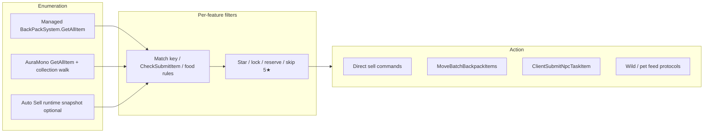

# Backpack, Warehouse, and Item Selection

How **Heartopia Helper** reads player inventory, filters stacks, sorts candidates, and sends server commands. Applies to **MelonLoader** and **BepInEx** (same `HeartopiaComplete` core).

For type lookup failures see [TYPE_RESOLUTION.md](./TYPE_RESOLUTION.md). For menu locations see [FEATURES.md](./FEATURES.md).

---

## Storage model (game)

| `EStorageType` value | Meaning | Mod constant |
|---------------------|---------|--------------|
| **1** | Backpack (bag) | `DailyQuestBackpackStorageType`, transfer source “Bag” |
| **2** | Warehouse | `DailyQuestWarehouseStorageType`, transfer source “Warehouse” |

Primary API: `XDTGameSystem.GameplaySystem.BackPack.BackPackSystem`

| Method | Role in mod |
|--------|-------------|
| `GetAllItem(EStorageType)` or `GetAllItem()` | Enumerate all stacks in one storage (AuraMono + managed) |
| `CheckSubmitItem(netId, submitTarget)` | Whether a stack satisfies a daily-order target row |
| `GetItems(...)` | Used by vanilla UI auto-picker (documented in probe log only) |

Network moves: `BackpackProtocolManager.MoveBatchBackpackItems(Dictionary<uint,int> netIdToCounts, int targetStorageType)` — max **256** stacks per batch; mod chunks larger selections.

Daily submit network: `TaskProtocolManager.ClientSubmitNpcTaskItem` / `ClientSubmitTaskItem` with `List<ItemNetPair>` (`netId`, `count`). The mod does **not** treat `AutoSubmitNpcTaskItem` as success (that path only opens dialogue).

---

## How the mod obtains items (three pipelines)

Features do not share one global inventory cache. Each subsystem scans when it runs.



### 1. Managed reflection

- Resolve `BackPackSystem` via `FindLoadedType` + `TryGetManagedModule` / static `Instance`.
- Call `GetAllItem` with `EStorageType` enum or raw `int` **1** / **2**.
- Read fields: `netId`, `count`, `staticId`, `starRate` / `_starRate`, lock flags.

Used by: **Auto Sell** (parallel with Mono), **Daily Quest submit** (managed pair builder).

### 2. AuraMono (`mono_runtime_invoke`)

- `TryResolveAuraMonoModule("XDTGameSystem.GameplaySystem.BackPack.BackPackSystem", ...)`.
- `FindAuraMonoMethodOnHierarchy(..., "GetAllItem", 1)` or arity **0**.
- `TryEnumerateAuraMonoCollectionItems` on returned list.
- Price: `GetItemPrice()` on item; fallback `TableData` `quickSalePrice` by `staticId`.

Used by: **Auto Sell**, **Bag/Warehouse transfer**, **Daily Quest submit**, **Wild animal feed**.

### 3. Auto Sell runtime snapshot (optional)

- When scan source is **Warehouse only** (`autoSellScanSource == 1`), an extra path reads live bag UI / runtime state before managed+Mono scans.
- Bag + warehouse scans still run according to **Scan source** (see below).

---

## Shared star normalization

`NormalizeAutoSellStarRate` (in `HeartopiaComplete`):

- `≤ 0` → **0** (unknown / no star UI)
- else clamp to **1–5**

**Skip 5★** toggles (default **on** where present) drop stacks with normalized star **≥ 5**:

| Feature | Config field | UI label |
|---------|--------------|----------|
| Auto Sell | `autoSellSkipFiveStar` | Skip 5 Star |
| Daily Quest submit | `dailyQuestSubmitSkipFiveStar` | Skip 5 Star Items |
| Wild animal feed | `wildAnimalFeedSkipFiveStarFood` | Skip 5 Star Food |

**Auto Sell star filter** (`autoSellStarFilter` 0–5): **0** = any star; **1–5** = only that star count (`AutoSellStarMatches`). Independent of skip-5★.

Transfer grid can filter tiles by star when picking stacks (same `autoSellStarFilter` in multi-select UI).

---

## Feature reference: obtain → filter → sort → act

| Feature | Tab | Storages scanned | Obtain | Filter | Sort / pick | Action |
|---------|-----|------------------|--------|--------|-------------|--------|
| **Auto Sell** | Features → Auto Sell | Bag / Warehouse / Both (dropdown) | Snapshot (warehouse-only mode) + managed + Mono `GetAllItem` | Item key substring match on descriptor; star filter; skip 5★; reserve groups; max per stack; sell full stack | Aggregates counts per `netId` (no “cheapest” sort — sells all matching stacks) | Direct sell / period-currency split |
| **Bag / Warehouse** | Bag / Warehouse | One side at a time (Bag **or** Warehouse) | Mono `GetAllItem` only | Locked stacks shown but **not** sent; `netId == 0` skipped | Display name **A→Z** | `MoveBatchBackpackItems` → opposite storage (1↔2) |
| **Daily Quest submit** | New Features → Daily Quests | **Backpack + warehouse together** | Managed + AuraMono; dedupe by `netId` | `CheckSubmitItem` per target row; locked skipped; skip 5★ optional | **Price ↑**, then **star ↑** (same as game `CompareSubmitItem`); greedy stack fill for `needNum` | `ClientSubmitNpcTaskItem` / Il2Cpp `List<ItemNetPair>`; verifies task state leaves `CanSubmit` (4) |
| **Daily Quest probe** | Same | N/A (reads `DailyOrderSystem` / tasks) | AuraMono table + task rows | Logs only | N/A | BepInEx / `helper.log` dump |
| **Wild animal feed** | New Features → Animal Care | Backpack (+ AuraMono path) | `GetAllItem` per storage; `GetAnimalFoodThough` | Allowed food static IDs; fullness for animal **group**; skip 5★ food; favorites boost bond in score | **SortScore ↓** = `bondExp×10000 + fullness` (favorite bond % bonus) | Trough feed commands |
| **Wild animal gifts** | Animal Care | ECS entity scan (`WildAnimalGiftFeature`) | Pending `AnimalGroup` from `HaveGift()`; gift box or `HaveGift(entity)` + group match | Order discovered in entity list | `AnimalProtocolManager.TakeGift` per `netId` (~0.45 s apart) |
| **Pet feed** | Features → Pet Care | `PetSystem.GetFoods()` (not full bag scan) | Managed + AuraMono pet APIs | `Count > 0`, `Fullness > 0`, not locked; user **selected food** filter | **Fullness ↑**, then **StaticId ↑** | `Begin` feed with food `netId` list per pet |
| **Auto Eat / Auto Repair** | Features → Food & Repair | Bag UI automation | Hard-coded UI paths under `XDUIRoot` | Repair kit / configured food key | First matching UI slot | Clicks Use / eat |
| **Warehouse Anywhere** | Bag / Warehouse (toggle) | N/A while bag closed | Detects bag open via Mono | Unlocks warehouse tab in bag UI (`TabWidget`, `SetBtnFrame`) | N/A | Client UI only — **not** API transfer |

Vanilla game reference (ILSpy): `BackPackSystem.CompareSubmitItem` — price ascending, then `starRate` ascending.

---

## Auto Sell (detail)

**Scan source** (`autoSellScanSource`):

| Index | Label | `GetAutoSellStorageTypeValues()` |
|-------|-------|----------------------------------|
| 0 | Bag | `[1]` |
| 1 | Warehouse | `[2]` (+ optional runtime snapshot first) |
| 2 | Both | `[1, 2]` |

**Item key matching** (`AutoSellDescriptorMatches`):

- Normalizes descriptor to a match key (strips UI noise).
- Sells if key **contains** configured sell key, or `p_<key>` variant (photo items).

**Reserve / grouping:** `reserveGroupsByNetId` uses descriptor + star so the mod can keep N stacks per group (`autoSellReserveCount`).

**Star on photos:** bird-photo descriptors may use cached UI star, `step` field (1–5), or `QualityComponent` via `DataCenter.TryGetComponentData`.

---

## Bag / Warehouse transfer (detail)

1. Choose **source**: Bag or Warehouse (dropdown).
2. **Refresh** → `ScanTransferItems` → `CollectTransferItemEntriesMono`.
3. Grid shows stack count, star, lock state; **Multi** mode: tap stacks, adjust qty, **Transfer**.
4. Sends `targetStorageType` **2** (to warehouse) or **1** (to bag).
5. Paths: managed `MoveBatchBackpackItems`, then AuraMono invoke fallback.

No star-based “cheapest first” — user picks stacks explicitly (or transfers one selected row).

---

## Daily Quests (detail)

**Probe** (`DailyQuestProbeFeature`): logs `DailyOrderSystem`, five order slots, `TableGameTask.submitTargetItem[]`, task state names, notes that vanilla UI uses `AutoSubmitNpcTaskItem`.

**Auto submit** (`DailyQuestSubmitFeature`, build id `direct-submit-v9`):

1. For each daily task in state **CanSubmit** (4) with item-delivery targets.
2. Merge all stacks from storage **1** and **2** (unique `netId`).
3. Per `submitTargetItem` row: collect candidates passing `CheckSubmitItem`.
4. Sort by **lowest price**, then **lowest star**; take counts until `needNum` satisfied (may split across stacks).
5. Send pairs via Il2Cpp list → managed `WebRequestUtility` → AuraMono list pointer.
6. After ~0.65 s delay, fail if state still **CanSubmit**.

**Important:** `ItemNetPair` lives in the game’s **EcsClient** assembly (not the same as wild-animal `List<uint>`). The mod resolves it via **`IL2CPP.GetIl2CppClass`** at runtime when **EcsClient.dll** is missing from BepInEx `interop/`, then builds `List<ItemNetPair>` with `Il2CppSystem` (`direct-submit-v10`). It also preloads interop DLLs when present for faster managed reflection. Submit uses `ClientSubmitNpcTaskItem` or `SubmitGameTaskItem2NpcCommand.SendCommand`. It does **not** use `mono_class_bind_generic_parameters` (asserts/crashes on IL2CPP mono).

Logs: `pick netId=… price=… star=…`; `Submit failed` lists `il2cpp=… managed=… auraNpc=…`.

Config: **Skip 5 Star Items** persisted in `KeybindConfigData.dailyQuestSubmitSkipFiveStar` (default **true**).

---

## Wild animal feed (detail)

- Scans backpack storage(s) for food static IDs valid for the trough **group**.
- **Skip 5 Star Food** excludes `starRate >= 5` before scoring.
- Picks highest **SortScore** (bond + fullness, favorites weighted).
- Reserves `netId` counts within one bulk run so the same stack is not double-spent.

Manual **Feed** button in UI; not the same code path as daily quest submit.

---

## Wild animal gifts (detail)

**File:** `buddy/WildAnimalGiftFeature.cs` (~700 lines). **Access:** AuraMono only (`mono_runtime_invoke`) — no `FindLoadedType`, no Il2Cpp interop types, no `mono_class_bind_generic_parameters`.

### Vanilla flow (ILSpy)

| Step | Game API | Role |
|------|----------|------|
| Red dot / pending groups | `WildAnimalProtocolManager.HaveGift()` → `IWildAnimalService.HaveGift()` | Which `AnimalGroup` values have unclaimed gifts |
| Gift box entities | `IWildAnimalService.GetGifts()` + `GiftBoxGroupProperty.Group` | Server-side gift boxes (mod uses entity scan instead — see below) |
| Animal gifts | `IWildAnimalService.GetAnimals(group)` + `WildAnimalProtocolManager.HaveGift(EcsEntity)` | Animals carrying visit/travel gifts |
| UI interact | `WildAnimalGiftCommand` (`InteractSetting(31)`) — `IsDisplayable` reads `WildAnimalGiftComponentData.value` or `WildAnimalComponentData.haveGift` | Manual pickup in world |
| Claim | `AnimalProtocolManager.TakeGift(uint)` → `AnimalGiftTakeNetworkCommand` | Authoritative server take |

Dump paths: `ProtocolService/WildAnimal/WildAnimalProtocolManager.cs`, `ProtocolService/Animal/AnimalProtocolManager.cs`, `XDT/Scene/Shared/Modules/Animal/AnimalUtil.cs`, `Gameplay/Interaction/Command/WildAnimalGiftCommand.cs`.

### Mod flow (`Claim All Wild Gifts`)

```
1. WildAnimalProtocolManager.HaveGift()          → giftCount + target AnimalGroup ids {2, 8, …}
2. TryEnumerateAuraMonoLoadedEntityObjects()
   For each entity netId:
     AnimalProtocolManager.GetNetworkEntity(netId)
     If AnimalUtil.IsGiftBox(entity) && GetGroup in target groups → add netId
     Else if WildAnimalProtocolManager.HaveGift(entity) && GetGroup in target groups → add netId
3. For each collected netId (re-validate alive + claimable):
     AnimalProtocolManager.TakeGift(netId)
```

**Pre-claim validation** (`TryOwnerNetIdHasClaimableWildGift`): same AuraMono checks as step 2 — `IsGiftBox`/`GetGroup` or `HaveGift(entity)`/`GetGroup`. No managed `DataCenter` fallback.

### Removed / non-working paths (do not re-add without BepInEx interop fix)

| Path | Why removed |
|------|-------------|
| `EcsService.TryGet<IWildAnimalService>` + `GetGifts()` / `GetAnimals()` | Interop types not loaded in BepInEx (`EcsService=False IWildAnimalService=False`) |
| Level-object scan (`LevelObjectManager`, interact id 31) | `displayable=0` — managed `DataCenter` unavailable; redundant once entity scan works |
| `GetSpecies(AnimalGroup)` | Species/trough entity, not a gift target |
| Managed `DataCenter.TryGetComponentData` | Same interop gap as daily-quest types; gift feature does not depend on it |

### Logs (`WildAnimalGiftLogsEnabled = true` in feature file)

Typical success:

```
[WildAnimalGift] HaveGift: count=2, groups=2
[WildAnimalGift] Entity scan: 2 from entity scan (inspected=… giftBoxes=2 animalGifts=0)
[WildAnimalGift] Collect done targets=2/2 netIds=[…]
[WildAnimalGift] TakeGift ok netId=…
```

| Log | Meaning |
|-----|---------|
| `HaveGift: count=0` | No pending gifts (red dots cleared) |
| `Entity scan failed: …` | AuraMono unavailable or empty entity list — enter world / wait for sync |
| `giftBoxes=0 animalGifts=0` with `pending>0` | Groups have gifts but entities not loaded yet — retry after animals/boxes spawn |
| `TakeGift failed: gift entity unavailable` | Entity despawned between scan and claim |
| `TakeGift failed: gift box wrong group` | Group filter mismatch (rare) |

Cooldown: 1.25 s between **Claim All** presses; 0.45 s between individual `TakeGift` calls in one run.

---

## Pet feed (detail)

- Does **not** scan `BackPackSystem` for all items.
- Uses `PetSystem` food list already filtered by game for pet feeding.
- Prefers **lowest fullness** food first (uses weaker food before stronger).
- Optional per-food selection in UI (`ApplyPetFeedSelectedFoodFilter`).

---

## Warehouse Anywhere (detail)

- Toggle **Warehouse Anywhere** on **Bag / Warehouse** tab (`warehouseBypassEnabled`).
- While the in-game bag is open, enables warehouse tab widgets that are normally gated (e.g. away from home).
- Does **not** replace **Bag / Warehouse** API transfer — use transfer for moving items without UI.

---

## Troubleshooting

| Symptom | Likely cause |
|---------|----------------|
| `BackPackSystem unavailable` | Type/module not loaded — enter town; check [TYPE_RESOLUTION.md](./TYPE_RESOLUTION.md) |
| `GetAllItem missing` | Game method arity/signature changed — update AuraMono lookup |
| `CheckSubmitItem missing` | Same; daily submit cannot match targets |
| `ItemNetPair type missing` | EcsClient not in Il2Cpp domain or interop — check log for `ItemNetPair Il2Cpp class missing`; regenerate interop or update mod after game patch |
| `still CanSubmit after delay` | Server rejected submit or wrong pairs — check `Submit failed` breakdown |
| `price=2147483647` in logs | `GetItemPrice` failed; sort uses `int.MaxValue` (sorts last) — table fallback may still apply |
| Auto sell finds nothing | Wrong item key, star filter, or scan source set to Warehouse while items are in bag |
| Transfer skips stack | `isLocked` or zero `netId` |
| Wild gifts `targets=0` with `pending>0` | Entity scan found no matching `GiftBoxGroupProperty` / `AnimalGiftComponent` — reload area or retry after sync |
| Wild gifts `AuraMono unavailable` | Mono API not ready — enter world, wait for AuraMono init |

Enable verbose gift logs: set `WildAnimalGiftLogsEnabled = true` in `WildAnimalGiftFeature.cs` (default on; rebuild required). Other features: `MasterLogDailyQuestSubmit`, etc. in `HeartopiaComplete.cs`.

---

## Source files

| File | Responsibility |
|------|----------------|
| `buddy/HeartopiaComplete.cs` | Auto sell scan/sell, transfer UI, star normalize, `GetAutoSellStorageTypeValues` |
| `buddy/DailyQuestSubmitFeature.cs` | Cheapest submit pairs + network send |
| `buddy/DailyQuestProbeFeature.cs` | Diagnostic dump |
| `buddy/WildAnimalFeedFeature.cs` | Trough food scan + sort score |
| `buddy/WildAnimalGiftFeature.cs` | Gift pending groups + ECS entity scan + `TakeGift` |
| `buddy/PetFeedFeature.cs` | Pet food list + sort |
| `buddy/WarehouseBypassFeature.cs` | Bag UI warehouse tab unlock |
| `ilspy-dumps/.../BackPackSystem.cs` | Vanilla `CompareSubmitItem`, `CheckSubmitItem` |

---

## Related documentation

- [FEATURES.md](./FEATURES.md) — menu tabs and user-facing options
- [TECHNICAL.md](./TECHNICAL.md) — architecture, config, Harmony
- [TYPE_RESOLUTION.md](./TYPE_RESOLUTION.md) — `FindLoadedType`, AuraMono, `ItemNetPair`
- [GAME_ASSEMBLIES_AND_TOOLS.md](./GAME_ASSEMBLIES_AND_TOOLS.md) — interop vs `DotnetAssemblies`, tools, EcsClient access paths
