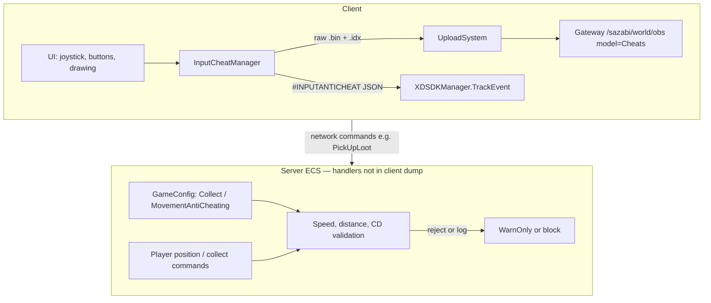

# Behavioral Anti-Cheat (Client Dump Analysis)

Analysis based on decompiled client sources in `ilspy-dumps/`. This document covers **behavioral** cheat detection: what is collected, when, and how it is sent to the server/backend.

**Not covered here:** MelonLoader, BepInEx, Harmony, mod folder scans, or loaded-assembly enumeration — none of these appear in the client dump.

---

## 1. Overview

Three largely independent layers:

| Layer | Where it runs | Visible in client dump |
|-------|---------------|------------------------|
| **Input anti-cheat** | Client collects; backend stores in OBS | Full `InputCheatManager` implementation |
| **Collect anti-cheat** | Server (inferred from config) | `CollectAntiCheating` config + GM command only |
| **Movement anti-cheat** | Server (inferred from config) | `MovementAntiCheating` config + GM command only |
| **LivePatcher integrity** | Client | Hotfix **file** integrity, not mod DLLs |

### Architecture (high level)



### Feature flags

`GameModuleName` (`EcsClient/XDT/Scene/Shared/Modules/GameModuleSwitch/GameModuleName.cs`):

- `CollectAntiCheating = 0x100`
- `MovementAntiCheating = 0x200`

Modules can be disabled per build/region via `IGameModuleSwitchService`. The dump does not show explicit `IsModuleClose` call sites for these flags—only the enum and config fields.

---

## 2. Input Anti-Cheat (`InputCheatManager`)

**Source:** `ilspy-dumps/XDTLevelAndEntity/XDTLevelAndEntity/BaseSystem/InputCheatManager/InputCheatManager.cs`

**Scope:** Active only on main game level (`[ModuleScope(typeof(GameLevel_Main))]`).

### 2.1 What is collected

Each significant touch event is a **12-byte** record:

| Field | Size | Meaning |
|-------|------|---------|
| Type + Index | 1 byte | Event type (Down / Move / Up) in high 4 bits; finger id 0–15 in low 4 bits |
| X | 3 bytes | Screen X |
| Force | 1 byte | Always `0` in `_PushInputData` |
| Y | 3 bytes | Screen Y |
| Source + Timestamp | 4 bytes | Source = `4` (touchscreen); timestamp = ms since buffer session start |

Before upload, the client computes **aggregates**:

| Field | Meaning |
|-------|---------|
| `track_cnt` | Total event count |
| `move_track_pct` | Percentage of Move events |
| `most_move_track_cnt` | Max points in one gesture |
| `move_track_speed` | Move events / gesture time × 1000 |
| `most_move_2point_distance` | √(max squared delta between Move samples) |
| `track_time` | Timestamp of last event |

### 2.2 When data is recorded

**UI hooks** (non-exhaustive):

- `PointerButton`, `JoyStickBase`, `HoldButton`, `BuildGestureComponent`, `SwapComponent`
- `DrawingPanel`, `SkillButtonWidget`, `InstrumentBtnWidget`, `ItemLongPressButton`

**Filters and session rules:**

- Events are **skipped** if `|deltaX| ≤ 1` and `|deltaY| ≤ 1` (micro-movements filtered out).
- After a successful upload, a **1-hour cooldown** (`UploadColddown = 3_600_000` ms) blocks starting a new buffer.
- `Source` is hardcoded to **4** (touchscreen) even when input comes from mouse/gamepad through Unity UI.

**Upload triggers (`Upload`):**

| Trigger | Constant / condition |
|---------|----------------------|
| Buffer full | `MaxDataCount = 10_000` events |
| Session age | `MaxTime = 3_600_000` ms (1 hour) since first event |
| Level teardown | `OnDestroy` |
| App quit | `OnApplicationQuit` (sync upload) |
| Sub-mode change | `EnterSubMode` / `ExitSubMode` (e.g. drawing mode `"Drawing"`) |

**Minimum for upload:** more than **`MinUploadCount = 100`** events; otherwise the buffer is cleared without upload.

### 2.3 How data is sent

Two parallel channels:

#### A. Analytics (summary)

`XDSDKManager.TrackEvent("#INPUTANTICHEAT", properties)`

JSON fields use naming policy prefix `#c_log_` (`date`, `platform`, `playerid`, `filename`, aggregates).

#### B. OBS “Cheats” bucket (raw + index)

| Object | Content |
|--------|---------|
| `.bin` | Concatenation of all 12-byte records |
| `.idx` | Six `int32` aggregate values |

**Object paths:**

```text
data/{yyyyMMdd}/Standalone/{encodeShortId}/{filetime}.bin
index/{yyyyMMdd}/Standalone/{encodeShortId}/{filetime}.idx
```

With sub-mode (e.g. drawing):

```text
data/{yyyyMMdd}/Standalone/{encodeShortId}/{submode}/{filetime}.bin
index/{yyyyMMdd}/Standalone/{encodeShortId}/{submode}/{filetime}.idx
```

**Upload pipeline:**

1. `InputCheatManager.Upload`
2. `UploadSystem.UploadCheat` → queue (max **3** concurrent uploads)
3. `IObsSDKManager.AsyncUploadStream(..., ObsClientType.Cheats)`
4. `ObsSdk.Upload`:
   - `GET {Gateway}/sazabi/world/obs?model=1&opt=Upload&objectId=...&os=...` → presigned `ObsOptData`
   - `PUT` bytes to object storage

On application quit: `SyncUploadStream` (bypasses queue).

`platform` is hardcoded as `"Standalone"` in upload metadata.

**Config reference** (`WorldServerAddressConfig`): OBS base URL is typically `{GatewayAddress}/sazabi/world/obs` (see `Obs` field).

---

## 3. Resource Collect Anti-Cheat (`CollectAntiCheating`)

**Config:** `EcsClient/XDT/Scene/Shared/Data/Scriptable/CollectAntiCheating.cs`  
**Embedded in:** `GameConfig.CollectAntiCheating` (header: “资源采集反作弊设置”).

**Client validation logic:** not found in the client C# dump—only configuration and a GM network command.

### 3.1 Default parameters

| Parameter | Default | Purpose (from headers) |
|-----------|---------|------------------------|
| `Distance` | 2 m | Max distance to resource when collecting |
| `IsNoCdInCloseDist` | true | Relax CD when collects are close together |
| `CloseDist` | 2 m | “Close” threshold for CD rules |
| `MaxSpeed` | 8.6 m/s | Max horizontal speed for **reachability** checks |
| `SpeedTolerance` | 1.1 | +10% buffer for lag / buffs |
| `Slack` | 2 m | Extra distance margin for small `dt` |
| `WarnOnly` | false | `true` = log only; `false` = enforce rejection |

### 3.2 Inferred server behavior

On collect-related network commands (e.g. `PickUpLootNetworkCommand` with `[VerifyEntity] uint itemNetId`), the server likely checks:

- Distance player ↔ resource entity
- Whether the player could **physically** reach the point given `MaxSpeed`, elapsed time, `SpeedTolerance`, and `Slack`
- Collect cooldown, with `CloseDist` / `IsNoCdInCloseDist` rules

The client only sends intent; loot/state changes require server acceptance.

### 3.3 GM override

`GmCollectAntiCheatingSetCommand` — runtime server override (`Cd`, `Distance`, `WarnOnly`, `MaxSpeed`, etc.).

---

## 4. Movement Anti-Cheat (`MovementAntiCheating`)

**Config:** `EcsClient/XDT/Scene/Shared/Data/Scriptable/MovementAntiCheating.cs`  
**Embedded in:** `GameConfig.MovementAntiCheating` (header: “角色移动反作弊设置”).

**Client implementation:** no references to `WindowSize`, `AbnormalRatio`, etc. outside config/GM—typical **server-side position sampling**.

### 4.1 Default parameters

| Parameter | Default | Interpretation |
|-----------|---------|----------------|
| `WindowSize` | 20 | Samples per analysis window |
| `SampleInterval` | 250 ms | Time between samples (~5 s per window) |
| `SpeedThresholdWalk` | 4.3 m/s | Speed cap on foot |
| `SpeedThresholdOnVehicle` | 9 m/s | Speed cap on vehicle |
| `AbnormalRatio` | 0.5 | Flag if ≥50% of samples exceed threshold |
| `ReportInterval` | 10 s | Reporting / logging interval (server-side) |

### 4.2 Inferred server behavior

The authoritative simulation accumulates position history, computes speed between samples, compares to walk/vehicle thresholds, and flags violations when the abnormal sample ratio exceeds `AbnormalRatio`. Exact enforcement (kick, rollback, ban) is not visible in the client dump.

### 4.3 GM override

`GmAntiCheatingMovementConfigCommand` — runtime override of all movement anti-cheat fields on the server.

**Mod relevance:** client-side speed/fly/teleport without server position sync should desync from authoritative state; detection is based on server trajectory, not client visuals alone.

---

## 5. Other Related Systems (Not Player Behavior)

| System | Role |
|--------|------|
| `ObsClientType.Cheats` / `ObsModel.Cheats` | Dedicated OBS model for telemetry (including input traces)—not mod-loader detection |
| `LivePatcher.IntegrityCheckResult` | Integrity of **hotfix/patch files**, not BepInEx/MelonLoader assemblies |
| ECS `[VerifyEntity]` on commands | General authoritative-server pattern; baseline action validation |

---

## 6. Risk Summary for Mod / Cheat Tool Authors

| Vector | Risk level | Notes |
|--------|------------|-------|
| Input telemetry | **High** for autoclickers/macros on hooked UI | Abnormal move ratios, speeds, gesture lengths; raw `.bin` in OBS |
| Movement | **High** for speed/fly/teleport | Server-side sampling; config thresholds above |
| Collect | **High** for remote collect / CD bypass | Reachability + distance checks |
| Loader / injector detection | **Not found** in this client dump | No scan for MelonLoader, BepInEx, Harmony, etc. |

---

## 7. Research Limitations

- Only **client** decompilation is available in this repository.
- Server-side handlers for `CollectAntiCheating` / `MovementAntiCheating` (Orleans/Sazabi ECS) are **not** in the dump; server behavior is **reconstructed** from config fields, GM commands, and standard authoritative-game patterns.
- Game build/version may change constants, URLs, and module flags.

---

## 8. Key Source Paths

| Topic | Path (under `ilspy-dumps/`) |
|-------|-------------------------------|
| Input collector | `XDTLevelAndEntity/.../InputCheatManager/InputCheatManager.cs` |
| Upload queue | `XDTLevelAndEntity/XDTGUI/Module/Upload/UploadSystem.cs` |
| OBS client | `XDTDataAndProtocol/Network/ObsSdk.cs` |
| Collect config | `EcsClient/.../CollectAntiCheating.cs` |
| Movement config | `EcsClient/.../MovementAntiCheating.cs` |
| Game config | `EcsClient/.../GameConfig.cs` |
| Module flags | `EcsClient/.../GameModuleSwitch/GameModuleName.cs` |
| GM collect | `EcsClient/.../GmCollectAntiCheatingSetCommand.cs` |
| GM movement | `EcsClient/.../GmAntiCheatingMovementConfigCommand.cs` |
| UI hook example | `XDTGameUI/XDTGUI/View/Components/PointerButton.cs` |

---

*Generated from ilspy-dumps analysis for the Heartopia-Helper project.*
