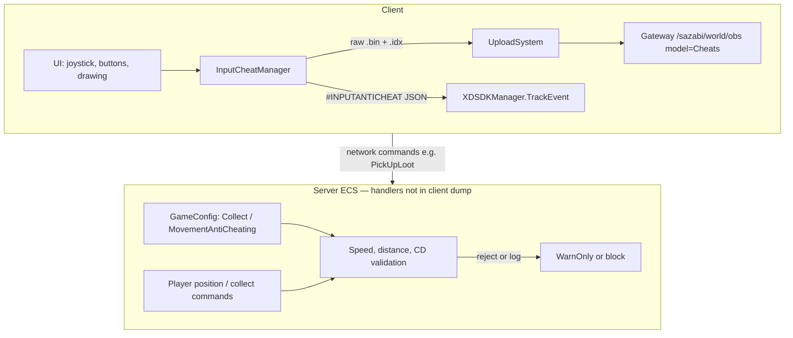

# Behavioral Anti-Cheat (Client Dump Analysis)

Analysis based on decompiled client sources in `ilspy-dumps/`. This document covers **behavioral** cheat detection: what is collected, when, and how it is sent to the server/backend.

**Not covered here:** MelonLoader, BepInEx, Harmony, mod folder scans, or loaded-assembly enumeration — none of these appear in the client dump.

---

## 1. Overview

Three largely independent layers:

| Layer | Where it runs | Visible in client dump |
|-------|---------------|------------------------|
| **Input anti-cheat** | Client collects; **backend** scores anomalies | Full `InputCheatManager` collector; **no** client cutoffs |
| **Collect anti-cheat** | Server (inferred from config) | `CollectAntiCheating` config + GM command only |
| **Movement anti-cheat** | Server (inferred from config) | `MovementAntiCheating` config + GM command only |
| **Native Themis** | Client native + server correlation | Managed binding only (§9) |
| **LivePatcher integrity** | Client | Hotfix **file** integrity, not mod DLLs |

### Architecture (high level)



### Feature flags

`GameModuleName` (`EcsClient/XDT/Scene/Shared/Modules/GameModuleSwitch/GameModuleName.cs`):

- `CollectAntiCheating = 0x100`
- `MovementAntiCheating = 0x200`

Modules can be disabled per build/region via `IGameModuleSwitchService`. The dump does not show explicit `IsModuleClose` call sites for these flags—only the enum and config fields.

---

## 2. Input Anti-Cheat (`InputCheatManager`)

**Source:** `ilspy-dumps/XDTLevelAndEntity/XDTLevelAndEntity/BaseSystem/InputCheatManager/InputCheatManager.cs`

**Scope:** Active only on main game level (`[ModuleScope(typeof(GameLevel_Main))]`).

### 2.1 What is collected

Each significant touch event is a **12-byte** record:

| Field | Size | Meaning |
|-------|------|---------|
| Type + Index | 1 byte | Event type (Down / Move / Up) in high 4 bits; finger id 0–15 in low 4 bits |
| X | 3 bytes | Screen X |
| Force | 1 byte | Always `0` in `_PushInputData` |
| Y | 3 bytes | Screen Y |
| Source + Timestamp | 4 bytes | Source = `4` (touchscreen); timestamp = ms since buffer session start |

Before upload, the client computes **aggregates**:

| Field | Meaning |
|-------|---------|
| `track_cnt` | Total event count |
| `move_track_pct` | Percentage of Move events |
| `most_move_track_cnt` | Max points in one gesture |
| `move_track_speed` | Move events / gesture time × 1000 |
| `most_move_2point_distance` | √(max squared delta between Move samples) |
| `track_time` | Timestamp of last event |

### 2.2 When data is recorded

**UI hooks** (non-exhaustive):

- `PointerButton`, `JoyStickBase`, `HoldButton`, `BuildGestureComponent`, `SwapComponent`
- `DrawingPanel`, `SkillButtonWidget`, `InstrumentBtnWidget`, `ItemLongPressButton`

**Filters and session rules:**

- Events are **skipped** if `|deltaX| ≤ 1` and `|deltaY| ≤ 1` (micro-movements filtered out).
- After a successful upload, a **1-hour cooldown** (`UploadColddown = 3_600_000` ms) blocks starting a new buffer.
- `Source` is hardcoded to **4** (touchscreen) even when input comes from mouse/gamepad through Unity UI.

**Upload triggers (`Upload`):**

| Trigger | Constant / condition |
|---------|----------------------|
| Buffer full | `MaxDataCount = 10_000` events |
| Session age | `MaxTime = 3_600_000` ms (1 hour) since first event |
| Level teardown | `OnDestroy` |
| App quit | `OnApplicationQuit` (sync upload) |
| Sub-mode change | `EnterSubMode` / `ExitSubMode` (e.g. drawing mode `"Drawing"`) |

**Minimum for upload:** more than **`MinUploadCount = 100`** events; otherwise the buffer is cleared without upload.

### 2.3 How data is sent

Two parallel channels:

#### A. Analytics (summary)

`XDSDKManager.TrackEvent("#INPUTANTICHEAT", properties)`

JSON fields use naming policy prefix `#c_log_` (`date`, `platform`, `playerid`, `filename`, aggregates).

#### B. OBS “Cheats” bucket (raw + index)

| Object | Content |
|--------|---------|
| `.bin` | Concatenation of all 12-byte records |
| `.idx` | Six `int32` aggregate values |

**Object paths:**

```text
data/{yyyyMMdd}/Standalone/{encodeShortId}/{filetime}.bin
index/{yyyyMMdd}/Standalone/{encodeShortId}/{filetime}.idx
```

With sub-mode (e.g. drawing):

```text
data/{yyyyMMdd}/Standalone/{encodeShortId}/{submode}/{filetime}.bin
index/{yyyyMMdd}/Standalone/{encodeShortId}/{submode}/{filetime}.idx
```

**Upload pipeline:**

1. `InputCheatManager.Upload`
2. `UploadSystem.UploadCheat` → queue (max **3** concurrent uploads)
3. `IObsSDKManager.AsyncUploadStream(..., ObsClientType.Cheats)`
4. `ObsSdk.Upload`:
   - `GET {Gateway}/sazabi/world/obs?model=1&opt=Upload&objectId=...&os=...` → presigned `ObsOptData`
   - `PUT` bytes to object storage

On application quit: `SyncUploadStream` (bypasses queue).

`platform` is hardcoded as `"Standalone"` in upload metadata.

**Config reference** (`WorldServerAddressConfig`): OBS base URL is typically `{GatewayAddress}/sazabi/world/obs` (see `Obs` field).

### 2.4 Client thresholds vs anomaly detection

**Important:** `InputCheatManager` defines **session/upload** thresholds only. It does **not** compare aggregates against cheat cutoffs or block gameplay locally. Any “anomaly” decision happens on the **backend** after OBS ingest and/or `#INPUTANTICHEAT` analytics.

| Constant | Value | Role |
|----------|-------|------|
| `MaxDataCount` | 10 000 | Flush buffer to OBS |
| `MaxTime` | 3 600 000 ms (1 h) | Flush by age |
| `MinUploadCount` | 100 | Below this: discard buffer, no upload |
| `UploadColddown` | 3 600 000 ms (1 h) | After upload, block new session start |
| Micro-movement filter | `\|deltaX\| ≤ 1` **and** `\|deltaY\| ≤ 1` | Drop event before append |

There is a public `Enable` property (default `true`), but the dump shows **no call sites** that toggle it.

### 2.5 Aggregate formulas (exact client math)

Computed in `Upload()` after finalizing per-finger gesture lists via `CalcMoveIndex`:

| Field | Formula | Notes |
|-------|---------|-------|
| `track_cnt` | `data.Count` | All Down/Move/Up records in session |
| `move_track_pct` | `(int)(total_move_track / data.Count * 100)` | Integer percent |
| `most_move_track_cnt` | Max Move count in one finger gesture | Updated on each `XDTouchUp` |
| `move_track_speed` | `(int)(total_move_track / total_move_time * 1000)` | `0` if `total_move_time == 0`; units ≈ Move events per second of gesture duration |
| `most_move_2point_distance` | `(int)√(max_move_2point_distance_square)` | Max squared delta between consecutive **Move** samples (`deltaX² + deltaY²`) |
| `track_time` | Last record’s `Timestamp` | Ms since session `_firstimestampe` |

Per-gesture timing: on `XDTouchUp`, `total_move_time += lastMove.Timestamp - firstMove.Timestamp` for that finger.

**Backend inference (not in client code):** analysts can flag sessions with e.g. very low `move_track_pct` (tap-only bots), very high `move_track_speed`, large `most_move_2point_distance` (pointer teleport between frames), or inconsistent raw `.bin` replay vs claimed aggregates.

### 2.6 Recording paths and blind spots

**Down / Up** — usually via `RecordPositionAndPushInputData`: delta = `eventData.position - lastPosition`.

**Move** — via `PushInputData` with `pointer.delta` / `touch.deltaPosition`.

**Default delta bypass:** `PushInputData(..., deltaX = 1000, deltaY = 1000)`. Down/Up from `GestureComponent.PushFingerInputData` omit delta → always pass the micro-movement filter.

**Hardcoded fields in every record:**

- `Force = 0`
- `Source = 4` (`AINPUT_SOURCE_TOUCHSCREEN`) even for mouse/PC Unity UI
- Finger id masked: `figner & 0xF` (0–15)

**Complete UI hook list (dump):**

| Component | Path under `ilspy-dumps/` |
|-----------|----------------------------|
| `PointerButton` | `XDTGameUI/XDTGUI.View.Components/PointerButton.cs` |
| `JoyStickBase` | `XDTGameUI/XDTGUI.View.Components/JoyStickBase.cs` |
| `HoldButton` | `XDTGameUI/XDTGUI.View.Components/HoldButton.cs` |
| `SwapComponent` | `XDTGameUI/XDTGUI.View.Components/SwapComponent.cs` |
| `BuildGestureComponent` | `XDTGameUI/XDTGUI.View.Components/BuildGestureComponent.cs` |
| `GestureComponent` | `XDTGameUI/XDTGUI.View.Components/GestureComponent.cs` |
| `DrawingPanel` | `XDTGameUI/XDTGame.UI.Panel/DrawingPanel.cs` |
| `SkillButtonWidget` | `XDTGameUI/XDTGame.UI.Widget/SkillButtonWidget.cs` |
| `InstrumentBtnWidget` | `XDTGameUI/XDTGame.UI.Widget/InstrumentBtnWidget.cs` |
| `ItemLongPressButton` | `XDTGameUI/XDTLevelAndEntity.Game.View.Components/ItemLongPressButton.cs` |

**Sub-mode:** `DrawingPanel` calls `InputCheatManager.EnterSubMode("Drawing")` on open and `ExitSubMode()` on close — each triggers upload and routes OBS objects under `.../{submode}/...`.

**Blind spot:** actions invoked through **game APIs** without passing through hooked Unity UI do **not** appear in `InputCheatManager`. Native Themis (`ThemisSDKManager.InputData`, §9) is a separate channel.

---

## 3. Resource Collect Anti-Cheat (`CollectAntiCheating`)

**Config:** `EcsClient/XDT/Scene/Shared/Data/Scriptable/CollectAntiCheating.cs`  
**Embedded in:** `GameConfig.CollectAntiCheating` (header: “资源采集反作弊设置”).

**Client validation logic:** not found in the client C# dump—only configuration and a GM network command.

### 3.1 Default parameters

| Parameter | Default | Purpose (from headers) |
|-----------|---------|------------------------|
| `Distance` | 2 m | Max distance to resource when collecting |
| `IsNoCdInCloseDist` | true | Relax CD when collects are close together |
| `CloseDist` | 2 m | “Close” threshold for CD rules |
| `MaxSpeed` | 8.6 m/s | Max horizontal speed for **reachability** checks |
| `SpeedTolerance` | 1.1 | +10% buffer for lag / buffs |
| `Slack` | 2 m | Extra distance margin for small `dt` |
| `WarnOnly` | false | `true` = log only; `false` = enforce rejection |

### 3.2 Inferred server behavior

On collect-related network commands, the server likely runs checks derived from config field headers (Chinese comments in `CollectAntiCheating.cs`). **No handler code** appears in the client dump.

#### Reconstructed validation (pseudocode)

```text
dist = horizontal_distance(player_pos, resource_pos)

// 1. Range check
if dist > Distance → reject (or log only if WarnOnly)

// 2. Reachability (anti teleport-collect)
dt = time_since_last_position_or_collect
max_reach = MaxSpeed * SpeedTolerance * dt + Slack
if distance_from_last_pos > max_reach → reject

// 3. Cooldown
if IsNoCdInCloseDist && dist_from_previous_collect <= CloseDist
    → skip CD enforcement
else
    → enforce Cd (runtime; see GM command)
```

With defaults: `max_reach = 8.6 × 1.1 × dt + 2` metres.

#### Network commands (client sends ID only)

| Command | Payload | Notes |
|---------|---------|-------|
| `PickUpLootNetworkCommand` | `[VerifyEntity] itemNetId` | `ResourceProtocolManager.SendPickLootCommand` |
| `ShakeTreeNetworkCommand` | `resourceNetId` | Bush shake |
| `AxeAttackTreeNetworkCommand` | `resourceNetId`, `isHit` | Tree chop |
| `HitStoneNetworkCommand` | `resourceNetId`, `isHit` | Mining |
| `WaterMapResourceNetworkCommand` | `resourceNetId` | Watering |

Client-side distance/CD validation for these commands was **not found**. The client sends intent; loot and resource state change only after server acceptance.

**Failure surface:** `PickUpLootNetworkEvent` carries `errorCode`. Client UI shows tip `10027` when `errorCode != 0` (`UIMessageSyncSystem`).

#### Correlation with game movement speeds

| Config / constant | Default | Context |
|-------------------|---------|---------|
| `CollectAntiCheating.MaxSpeed` | 8.6 m/s | Reachability cap |
| `MotionInfo.MovingSpeedLimit` | 4.0 m/s | On-foot run cap |
| `VehicleSystemConfig.AnimatorBikeForwardRunMaxSpeed` | 10.5 m/s | Bike animation cap |
| `VehicleSystemConfig.AnimatorCarForwardRunMaxSpeed` | 12 m/s | Car animation cap |

`MaxSpeed = 8.6` sits above foot speed but below full vehicle top speed — consistent with allowing mounted travel while blocking impossible cross-map collects.

### 3.3 GM override

`GmCollectAntiCheatingSetCommand` — runtime server override. Fields: `Cd`, `Distance`, `IsNoCdInCloseDist`, `CloseDist`, `MaxSpeed`, `SpeedTolerance`, `Slack`, `WarnOnly`.

**Note:** `Cd` exists on the GM command but **not** on `CollectAntiCheating` ScriptableObject — collect cooldown is likely stored and tuned server-side separately from shipped defaults.

---

## 4. Movement Anti-Cheat (`MovementAntiCheating`)

**Config:** `EcsClient/XDT/Scene/Shared/Data/Scriptable/MovementAntiCheating.cs`  
**Embedded in:** `GameConfig.MovementAntiCheating` (header: “角色移动反作弊设置”).

**Client implementation:** no references to `WindowSize`, `AbnormalRatio`, etc. outside config/GM—typical **server-side position sampling**.

### 4.1 Default parameters

| Parameter | Default | Interpretation |
|-----------|---------|----------------|
| `WindowSize` | 20 | Samples per analysis window |
| `SampleInterval` | 250 ms | Time between samples (~5 s per window) |
| `SpeedThresholdWalk` | 4.3 m/s | Speed cap on foot |
| `SpeedThresholdOnVehicle` | 9 m/s | Speed cap on vehicle |
| `AbnormalRatio` | 0.5 | Flag if ≥50% of samples exceed threshold |
| `ReportInterval` | 10 s | Reporting / logging interval (server-side) |

### 4.2 Inferred server behavior

The authoritative simulation likely samples player position on an interval, computes horizontal speed between samples, and compares against walk vs vehicle thresholds. **No sampling code** appears in the client dump.

#### Reconstructed algorithm (pseudocode)

```text
every SampleInterval ms (250):
    sample authoritative horizontal position

window = last WindowSize samples (20)  → 20 × 250 ms = 5 s

abnormal = 0
for each consecutive pair in window:
    speed = horizontal_distance / dt
    threshold = on_vehicle ? SpeedThresholdOnVehicle : SpeedThresholdWalk
    if speed > threshold:
        abnormal++

if abnormal / WindowSize >= AbnormalRatio (0.5):
    flag violation

every ReportInterval s (10):
    log / report / escalate (exact action not in dump)
```

**Flag condition with defaults:** ≥ **10 of 20** samples in a 5 s window exceed **4.3 m/s** on foot or **9.0 m/s** on vehicle.

#### Correlation with game movement speeds

| Anti-cheat field | Default | Game reference | Margin |
|------------------|---------|----------------|--------|
| `SpeedThresholdWalk` | 4.3 m/s | `MotionInfo.MovingSpeedLimit` = 4.0 m/s | +7.5% |
| `SpeedThresholdOnVehicle` | 9.0 m/s | Bike 10.5 / car 12 m/s | Conservative vs vehicle caps |
| `AbnormalRatio` | 0.5 | — | Majority of window must be “fast” |

**Buff caveat:** client syncs `MoveSpeedWalkBonus` (`PlayerSyncClientService` / `PropertySyncSystem`). Legitimate buffs can push speed above 4.3 m/s briefly. Unlike collect reachability, movement anti-cheat has **no** explicit `SpeedTolerance` field — server may hard-code slack or use a separate tuning path.

Exact enforcement (rollback, kick, ban) is not visible in the client dump.

### 4.3 GM override

`GmAntiCheatingMovementConfigCommand` — runtime override of all movement anti-cheat fields on the server.

**Mod relevance:** client-side speed/fly/teleport without server position sync should desync from authoritative state; detection is based on server trajectory, not client visuals alone.

---

## 5. Other Related Systems (Not Player Behavior)

| System | Role |
|--------|------|
| `ObsClientType.Cheats` / `ObsModel.Cheats` | Dedicated OBS model for telemetry (including input traces)—not mod-loader detection |
| `LivePatcher.IntegrityCheckResult` | Integrity of **hotfix/patch files**, not BepInEx/MelonLoader assemblies |
| ECS `[VerifyEntity]` on commands | General authoritative-server pattern; baseline action validation |

---

## 6. Risk Summary for Mod / Cheat Tool Authors

| Vector | Risk level | Notes |
|--------|------------|-------|
| Input telemetry (hooked UI) | **High** for autoclickers/macros | Raw `.bin` replay + aggregates; backend defines anomaly cutoffs (§2.4–2.5) |
| Input via game API (no UI hook) | **Medium** for ICM, **High** for Themis | ICM blind spot; native AC may still observe (§9) |
| Movement | **High** for speed/fly/teleport | Server sampling; ≥50% of 5 s window over 4.3 / 9.0 m/s (§4.2) |
| Collect | **High** for remote collect / CD bypass | `dist ≤ 2 m`, reachability `8.6×1.1×dt+2`, CD rules (§3.2) |
| Collect (`WarnOnly=true`) | **Medium** | Server may log without rejecting — gray rollout |
| Loader / injector detection | **Not in managed dump** | Native Themis present (§9); treat as potentially active |

---

## 7. Research Limitations

- Only **client** decompilation is available in this repository.
- Server-side handlers for `CollectAntiCheating` / `MovementAntiCheating` (Orleans/Sazabi ECS) are **not** in the dump; §3.2 and §4.2 are **reconstructed** from config headers, GM commands, and game speed constants.
- `InputCheatManager` anomaly cutoffs are **not** in the client; §2.5 lists aggregates only.
- No `IsModuleClose(CollectAntiCheating | MovementAntiCheating)` call sites found — module gating may be server-only.
- Game build/version may change constants, URLs, and module flags.

---

## 8. Key Source Paths

| Topic | Path (under `ilspy-dumps/`) |
|-------|-------------------------------|
| Input collector | `XDTLevelAndEntity/XDTLevelAndEntity.BaseSystem.InputCheatManager/InputCheatManager.cs` |
| Upload queue | `XDTLevelAndEntity/XDTGUI.Module.Upload/UploadSystem.cs` |
| OBS client | `XDTDataAndProtocol/Network/ObsSdk.cs` |
| Collect config | `EcsClient/XDT.Scene.Shared.Data.Scriptable/CollectAntiCheating.cs` |
| Movement config | `EcsClient/XDT.Scene.Shared.Data.Scriptable/MovementAntiCheating.cs` |
| Motion defaults | `EcsClient/EcsClient.XDT.Scene.Shared.Data.ServerData/MotionInfo.cs`, `MotionConfig.cs` |
| Vehicle speed caps | `XDTLevelAndEntity/XDTLevelAndEntity.GameplaySystem.Vehicle/VehicleSystemConfig.cs` |
| Game config | `EcsClient/XDT.Scene.Shared.Data.Scriptable/GameConfig.cs` |
| Module flags | `EcsClient/XDT.Scene.Shared.Modules.GameModuleSwitch/GameModuleName.cs` |
| GM collect | `EcsClient/XDT.Scene.Shared.World.MapResource/GmCollectAntiCheatingSetCommand.cs` |
| GM movement | `EcsClient/XDT.Scene.Shared.Modules.GM/GmAntiCheatingMovementConfigCommand.cs` |
| Collect commands | `EcsClient/XDT.Scene.Shared.World.MapResource/PickUpLootNetworkCommand.cs`, `ShakeTreeNetworkCommand.cs`, etc. |
| Client collect send | `XDTDataAndProtocol/XDTDataAndProtocol.ProtocolService.Resource/ResourceProtocolManager.cs` |
| PickUpLoot UI error | `EcsSystem/EcsSystem.ClientSystem.UI/UIMessageSyncSystem.cs` |
| UI hook example | `XDTGameUI/XDTGUI.View.Components/PointerButton.cs` |
| Drawing sub-mode | `XDTGameUI/XDTGame.UI.Panel/DrawingPanel.cs` |

---

## 9. Native Anti-Cheat — TapTap Themis

> Added after IL-deobfuscation of the full client dump. This is the layer §6 previously listed as
> "Loader / injector detection: **Not found**" — it exists, but its detection logic is **native**
> (engine + `themis.res`), so only the thin managed binding is visible in the dump.

**Managed binding:** `ilspy-dumps/EngineWrapper/ThemisSDKManager.cs` (all real work is `[MethodImpl(InternalCall)]`
`icall_*` into native), plus the game wrapper `ilspy-dumps/XDTBaseService/ThemisManager.cs`.
Native config ships as `<Game>/themis.res`.

### What the managed surface exposes

| Capability | API (`ThemisSDKManager`) | Purpose |
|-----------|--------------------------|---------|
| Init / enable | `InitTHEMIS`, `TMInit`, `SetSwitch(bool)`, `TMCR(scene,on)` | Bring up native AC; toggled per scene/flow |
| **Integrity heartbeat** | `GetHeartbeat(index, random)` | Challenge→signed token; validated server-side. Native-driven (no managed caller) |
| Device identity | `GetOneID`, `GetOneidData`, `SetGamePlayer`, `SetGameScene` | Fingerprint / OneID sent at login |
| **Input feed** | `InputData(type, force, x, y, index, source)` | Raw input into native AC (parallel to `InputCheatManager`) |
| Context tags | `AddCustomPlayer(key, value)` | Tags reports: player/scene state, pos, level, timestamps |
| Reporting | `ReportException`, `ReportLogError`, `ReportCustomException(Ex)` | Send events; `isQuitApp` flag can **force-close the game** |
| **Auto-kill** | `AutoQuitApplicationAfterReport`, `U3d_ConfigAutoQuitApplication`, `U3d_ConfigAutoReportLogLevel` | Native may quit the app automatically on a report |
| Native→managed callback | `AddCallback(asm, ns, type, method)` + `SetUseExtendCallback` | Native AC invokes managed `[ExportMethod]` snapshots |

### How it is wired (call sites)

- **Login:** `ClientSession` sends `FingerPrint = GetOneidData()` and tags `xdid` / `playerinfo` / `shortid`;
  `SceneTcpConnectionHandler` sends `Device = GetOneID()`.
- **Context tagging:** `ThemisManager.SetPlayerState / SetCurScene / UpdatePlayerPos / SetCurLevel / AddTime`
  push player state, scene, **position**, level and timestamps via `AddCustomPlayer` (e.g.
  `PlayerStateFishing` → `SetPlayerState(Fish)`).
- **Native callback:** `EntityManager.InitThemisCallbacl()` registers `ExtraEntityMsg` with native AC.
  When the native side builds a report/heartbeat it calls back into managed `ExtraEntityMsg()`, which
  snapshots **self-player position, player state, vehicle status, character mode, player count**:

  ```csharp
  [ExportMethod] public static string ExtraEntityMsg() { ... PlayerPos:{entity.position},State:{...} ... }
  ```
- **Scene toggles:** `PackageUpdatePanel` does `SetSwitch(false)` during package update.

### Detection model & implications

- The actual detection (memory/tamper/injection/hook/debugger/speed checks) lives in **native Themis**
  and is **not** in the managed dump — the exact checks cannot be enumerated from `ilspy-dumps/`.
- **The dump's managed callback leaks game state into AC reports:** `ExtraEntityMsg` reads
  `entity.position` and `playerState` directly. Teleport / fly / speed / state-spoof mods that mutate
  these are captured *at report time* and correlated server-side — independent of the §2 input layer.
- **Two input channels:** input is fed to both `InputCheatManager` (OBS traces, §2) **and**
  `ThemisSDKManager.InputData` (native). Absent/synthetic input around game actions is observable to
  both; the project already prefers calling game APIs over `Input` simulation for this reason.
- **Auto-quit:** native Themis can call `ReportCustomException(..., isQuitApp:true)` or honor
  `AutoQuitApplicationAfterReport` — a detection can close the client outright.

### Updated risk note

§6's "Loader / injector detection: **Not found**" should read: **not found in managed code; a native
anti-cheat (Themis) is present** whose detection logic is out of dump scope. Treat process integrity,
injected modules, and memory edits as potentially observed by the native layer even though no managed
scan exists.

### Key source paths

| Topic | Path (under `ilspy-dumps/`) |
|-------|-------------------------------|
| Themis managed binding | `EngineWrapper/ThemisSDKManager.cs` |
| Game wrapper | `XDTBaseService/ThemisManager.cs` |
| Native callback snapshot | `XDTLevelAndEntity/ScriptsRefactory.LevelAndEntity.BaseSystem/EntityManager.cs` (`ExtraEntityMsg`) |
| Login fingerprint | `XDTGameSystem/XDTGameSystem/ClientSession.cs` |
| Device id at connect | `EcsSystem/Network/SceneTcpConnectionHandler.cs` |

---

*Updated from ilspy-dumps analysis for the Heartopia-Helper project. Deep-dive sections 2.4–2.6, 3.2, 4.2 added from latest dump review.*
