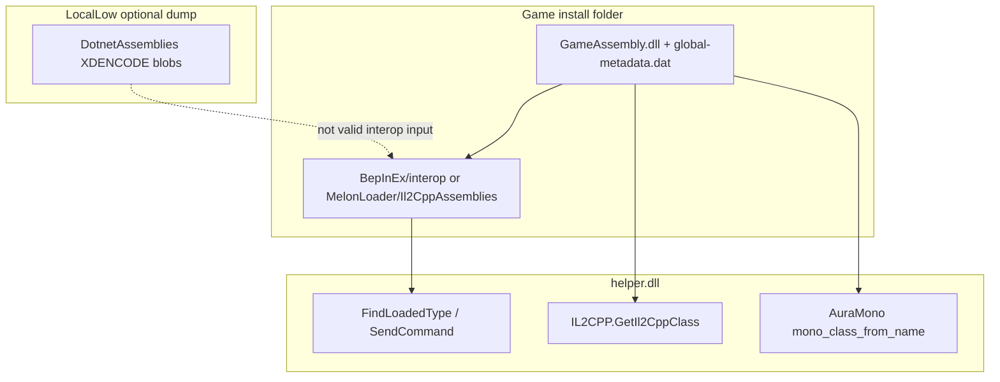

# Game Assemblies, API Access, and Tools

How **Heartopia Helper** reaches game code at runtime, where assemblies live on disk, which tools to use for research, and what **cannot** be substituted (for example `LocalLow` assembly dumps vs BepInEx interop).

Related: [BUILD_AND_RUN.md](./BUILD_AND_RUN.md), [TYPE_RESOLUTION.md](./TYPE_RESOLUTION.md), [BACKPACK_AND_ITEMS.md](./BACKPACK_AND_ITEMS.md), [TECHNICAL.md](./TECHNICAL.md).

---

## Overview: three runtimes in one game

Heartopia uses a **hybrid** client. The mod touches up to three separate type systems:

| Layer | What it is | Used by the mod for |
|-------|------------|---------------------|
| **IL2CPP (native)** | `GameAssembly.dll` + `il2cpp_data/Metadata/global-metadata.dat` in the game folder | Most gameplay, networking stubs, BepInEx/MelonLoader hooks, `IL2CPP.GetIl2CppClass`, Harmony |
| **BepInEx / MelonLoader interop** | Generated managed **wrappers** (`Il2Cpp*`, `Il2CppSystem`) under the loader folder | Compile-time references, `FindLoadedType`, `Il2CppSystem.Collections.Generic.List<>`, `SendCommand<T>` |
| **Embedded Mono (Aura)** | Game’s Mono module (`mono-2.0-bdwgc.dll` etc.) with images like `EcsClient`, `XDTLevelAndEntity` | Aura Farm, some protocol invokes, `mono_class_from_name` when IL2CPP stubs are incomplete |

The mod does **not** ship game assemblies. It resolves types at runtime via reflection, Il2CppInterop, and (in some features) Mono exports.



---

## Key game modules (names to search in ILSpy / logs)

| Assembly / image | Typical namespaces | Mod usage examples |
|------------------|-------------------|-------------------|
| **EcsClient** | `XDT.Scene.Shared.Modules.*`, `EcsClient.TableData` | `ItemNetPair`, task submit commands, store/ECS, anti-cheat config (research) |
| **Client** | Overlap with `XDT.Scene.*`, shared modules | Fallback when EcsClient interop is missing |
| **XDTDataAndProtocol** | `XDTDataAndProtocol.ProtocolService.*` | `TaskProtocolManager`, `WebRequestUtility.SendCommand` |
| **XDTLevelAndEntity** | `XDTLevelAndEntity.*`, `ScriptsRefactory.*` | Entities, interact, birds, fishing components |
| **XDTGameSystem** | `XDTGameSystem.GameplaySystem.*` | `BackPackSystem`, gameplay systems |
| **XDTGameUI** | `XDTGame.*` | UI panels |
| **Assembly-CSharp** | Unity / mixed | Fallback interop assembly |
| **EcsSystem** | Network managers | Client networking (research) |

Namespaces starting with `XDT.Scene.` are documented in [TYPE_RESOLUTION.md](./TYPE_RESOLUTION.md) as usually living in **EcsClient** or **Client**.

---

## Disk locations (Windows)

Replace `<Game>` with your Heartopia install (Steam, TapTap, etc.). Replace `<User>` with your Windows profile.

| Path | Contents | Role for the mod |
|------|----------|------------------|
| `<Game>/GameAssembly.dll` | IL2CPP binary | Source for interop generation; native class layout |
| `<Game>/Heartopia_Data/il2cpp_data/Metadata/global-metadata.dat` | IL2CPP metadata | Required for Il2CppInterop generator |
| `<Game>/BepInEx/interop/*.dll` | BepInEx-generated interop | Build references (`buddy.csproj`), `Assembly.LoadFrom` preload |
| `<Game>/MelonLoader/Il2CppAssemblies/*.dll` | MelonLoader interop | Same for MelonLoader builds |
| `<Game>/BepInEx/plugins/helper.dll` | Mod deploy target | — |
| `<User>/AppData/LocalLow/HelperSettings/` | Mod config (`Config.xml`) | Not game assemblies |
| `<User>/AppData/LocalLow/xd/Heartopia/DotnetAssemblies/` | **Game dump** (optional, often XDENCODE) | Research only; see [DotnetAssemblies dumps](#dotnetassemblies-dumps-locallow) |
| `<User>/AppData/LocalLow/HelperSettings/MonoDump/` | **Mono PE dump** (mod settings tree) | **ILSpy/dnSpy** — best offline copy of game Mono modules; see [MonoDump](#monodump-helpersettings) |
| Repo `ilspy-dumps/` (if present) | Decompiled C# from past patches | Naming reference for `FindLoadedType` aliases |

**BepInEx logs (example):** `<Game>/BepInEx/LogOutput.log`  
**MelonLoader logs:** `<Game>/MelonLoader/Latest.log`

---

## How the mod accesses game functions

### 1. Managed reflection (`FindLoadedType`)

- **Location:** `HeartopiaComplete.FindLoadedType` (see [TYPE_RESOLUTION.md](./TYPE_RESOLUTION.md)).
- **Requires:** Interop (or other) assemblies loaded in the mod `AppDomain`.
- **Used for:** `TaskProtocolManager`, command structs, `BackPackSystem`, UI types, most menu features.

Daily quest preload (optional disk load):

- `DailyQuestSubmitFeature.EnsureDailyQuestInteropAssembliesLoaded()` loads `EcsClient.dll`, `Client.dll`, `XDTDataAndProtocol.dll` from the loader interop folder when files exist.

### 2. IL2CPP runtime (`IL2CPP.*`)

- **Package:** `Il2CppInterop.Runtime` (referenced from loader `core` / `net6`).
- **Examples:** `IL2CPP.GetIl2CppClass("EcsClient.dll", "XDT.Scene.Shared.Modules.Backpack", "ItemNetPair")`; `HeartopiaComplete.TryFindIl2CppClass` (`il2cpp_domain_get_assemblies`, `il2cpp_class_from_name`).
- **Used when:** Interop DLL missing (for example no `EcsClient.dll` in `BepInEx/interop`) but the class exists in the live game domain — **daily quest submit v10** (`direct-submit-v10`).

### 3. Network commands (`WebRequestUtility.SendCommand<T>`)

- Resolve command **struct** type (often `XDT.Scene.Shared.Modules.*` in EcsClient/Client).
- Resolve `WebRequestUtility` + `ChannelType` from `XDTDataAndProtocol`.
- `MakeGenericMethod` + `Invoke` — see [TYPE_RESOLUTION.md](./TYPE_RESOLUTION.md) § Integration strategies.

### 4. AuraMono (embedded Mono API)

- **Location:** `AuraFarm.cs` — `mono_class_from_name`, `mono_runtime_invoke`, `FindAuraMonoImage("EcsClient", "EcsClient.dll")`.
- **Requires:** `EnsureAuraMonoApiReady()` + `AttachAuraMonoThread()`.
- **Used for:** Resource pick, net cook, pet feed `List<uint>`, daily quest Aura fallback, store/table data when managed types fail.
- **Not used for:** Binding `List<ItemNetPair>` via `mono_class_bind_generic_parameters` (crashes on this game).

### 5. Harmony patches

- Patch IL2CPP methods after resolving `Type` + `MethodInfo` from interop/reflection.
- See [TECHNICAL.md](./TECHNICAL.md).

---

## DotnetAssemblies dumps (LocalLow)

Some builds write assembly blobs under:

```text
%USERPROFILE%\AppData\LocalLow\xd\Heartopia\DotnetAssemblies\
```

Example files: `EcsClient.dll`, `XDTDataAndProtocol.dll`, `XDTLevelAndEntity.dll`, plus many `System.*.dll`.

### Format (important)

| File kind | Format | Usable as BepInEx interop? |
|-----------|--------|----------------------------|
| Game modules (`EcsClient.dll`, `XDT*.dll`, …) | Custom header **`XDENCODE0001`** — not a PE/.NET assembly | **No** |
| `System.Private.CoreLib.dll`, `System.*.dll` | Normal .NET PE (CLI metadata) | **No** for interop — wrong ABI; useful only as reference for BCL version |

Checks you can run locally:

- Valid .NET assembly: starts with `MZ`, contains `BSJB`, loads with `AssemblyName.GetAssemblyName(path)`.
- Game dumps in this folder: typically **no** `MZ` at offset 0, **no** `BSJB`; CLR reports *incorrect format*.

### What you can do with DotnetAssemblies

| Goal | Approach |
|------|----------|
| Know module names | Use file names (`EcsClient`, `XDTDataAndProtocol`, …) — matches mod search lists |
| Decompile game logic | Prefer **IL2CPP** dump (Cpp2IL / ILSpy on interop) or repo `ilspy-dumps/`; decode XDENCODE only if you have the game’s decoder |
| Fix mod `ItemNetPair missing` | Regenerate **loader interop** from `<Game>` or rely on **IL2CPP runtime** in mod v10+ |
| Copy into `BepInEx/interop` | **Do not** — will not replace `Il2CppInterop` stubs |

---

## Decrypting DotnetAssemblies at runtime (built-in dumper)

The mod can produce **decrypted, file-layout PEs** of every XDENCODE game module
(`EcsClient`, `EcsSystem`, `XDT*`, `Plugins`, `EngineWrapper`, `ScriptBridge`, `MonoShared`,
`MonoUniTask`, `MsgPackFormatters`, `XDKWPerf`) without reversing the XDENCODE format — it grabs
the bytes the game itself hands its runtime *after* decryption.

### Why a managed CoreCLR hook is not enough

There are **two separate .NET runtimes in the process**, with different `System.Private.CoreLib`:

| Runtime | corelib | What lives here |
|---------|---------|-----------------|
| BepInEx / `helper.dll` | `dotnet\System.Private.CoreLib.dll` (~10.6 MB) | BepInEx, Il2CppInterop, interop stubs, BCL |
| **Game (embedded Mono)** | `DotnetAssemblies\System.Private.CoreLib.dll` (~4.5 MB) | **EcsClient, EcsSystem, XDT\*, …** |

The game's modules run in an **embedded Mono runtime**, `xdt_Data\Plugins\x86_64\mono-2.0-sgen.dll`
— *not* in the CoreCLR that hosts the mod. A managed hook on `AssemblyLoadContext.LoadFromStream`
would only see BepInEx-side assemblies and **never** the game modules, so the dumper goes through the
Mono C API instead.

### How the dumper works

[MonoAssemblyDump.cs](../buddy/MonoAssemblyDump.cs) talks to the Mono C API exported by
`mono-2.0-sgen.dll`:

1. `mono_get_root_domain` + `mono_thread_attach` — attach the calling thread.
2. `mono_assembly_foreach` → `mono_assembly_get_image` — enumerate every loaded image.
3. **Filter to game modules only** — keep `EcsClient`, `EcsSystem`, `Plugins`, `EngineWrapper`,
   `ScriptBridge`, `MonoShared`, `MonoUniTask`, `MsgPackFormatters`, `XDKWPerf` and any `XDT*`; skip
   the BCL and every other Mono image.
4. Recover the decrypted PE from the `MonoImage` struct. `mono_image_get_raw_data` is **not
   exported** by this build, so the `raw_data`/`raw_data_len` pair is found by scanning the struct
   for a pointer to an `MZ` buffer that validates as a managed PE (`MZ` + `BSJB`). The offset is
   discovered once and reused. **Every native read is guarded by `VirtualQuery`**, so a bad pointer
   can never crash the process.
5. `mono_image_get_name` names each file; bytes are written verbatim.

If a future patch exports `mono_image_get_raw_data`, prefer it over the struct scan.

### Trigger and the opt-in folder

Output: `%USERPROFILE%\AppData\LocalLow\HelperSettings\DecryptedAssemblies\`.

An **empty folder is the opt-in switch** — there is no hotkey:

- **Folder exists and is empty** → the mod **auto-dumps once**, the first time the game's Mono
  runtime becomes ready (hooked in `EnsureAuraMonoApiReady`, [AuraFarm.cs](../buddy/AuraFarm.cs)).
- **Folder has files** (a previous dump) → **nothing runs** — clear it to re-dump.
- **Folder absent** → **nothing is dumped and the folder is never created.**

To enable: create the empty `DecryptedAssemblies` folder, then enter the world. Look for
`[MonoDump] auto-dump after runtime ready: N game module(s)` and `[MonoDump] saved …` in
`BepInEx\LogOutput.log`. Validate a result with `[Reflection.AssemblyName]::GetAssemblyName(path)` —
it should report e.g. `EcsClient, Version=1.0.0.0`. Decompile the dumped PEs in ILSpy / dnSpy.

---

## MonoDump (HelperSettings)

If the mod (or a debug build) writes Mono module dumps, they often land under:

```text
%USERPROFILE%\AppData\LocalLow\HelperSettings\MonoDump\
```

Example files: `EcsClient.dll`, `XDTDataAndProtocol.dll`, `XDTLevelAndEntity.dll`, `XDTGameSystem.dll`, …

### Format (differs from `xd/Heartopia/DotnetAssemblies`)

| Check | MonoDump `EcsClient.dll` | `xd/.../DotnetAssemblies/EcsClient.dll` |
|-------|--------------------------|----------------------------------------|
| PE `MZ` header | **Yes** | No (often `XDENCODE0001`) |
| CLI metadata `BSJB` | **Yes** | No |
| `AssemblyName.GetAssemblyName` | **Works** (`EcsClient, Version=1.0.0.0`) | Fails (*incorrect format*) |

These are **real managed assemblies** from the game’s **embedded Mono** side (the same logical modules AuraMono loads as `EcsClient.dll` images).

### Useful for tools?

| Tool / goal | Use MonoDump? | Notes |
|-------------|---------------|--------|
| **ILSpy / dnSpy** | **Yes — recommended** | Open `EcsClient.dll`, `XDTDataAndProtocol.dll`; find `ItemNetPair`, `TaskProtocolManager`, namespaces for `FindLoadedType` aliases |
| **Compare with repo `ilspy-dumps/`** | Yes | Names and signatures after a patch |
| **Cpp2IL / Il2CppInterop generator** | **No** | Input must be IL2CPP `GameAssembly` + `global-metadata.dat`, not Mono PE |
| **Copy into `BepInEx/interop`** | **No** | Interop stubs are Il2Cpp wrappers, not these Mono DLLs |
| **`dotnet build` reference** | Optional, dev-only | You could point `HintPath` at MonoDump for **reading** APIs; types are **not** the same as runtime Il2Cpp interop — do not assume `Invoke` on live game objects will match |
| **Runtime `Assembly.LoadFrom` in mod** | Discouraged | Duplicate type universe vs Il2Cpp interop; use IL2CPP/AuraMono paths instead |
| **Ship on another PC with the game** | **No** | Other players only need `<Game>/BepInEx/interop/` + `helper.dll`; MonoDump is for **your** reverse engineering |

### Practical workflow

1. Decompile `MonoDump/EcsClient.dll` in ILSpy → copy full type names into `FindLoadedType` / docs.
2. Regenerate **BepInEx interop** from the game install for actual mod runtime.
3. Keep MonoDump version aligned with the **same game patch** as your interop and `helper.dll`.

---

## Generating BepInEx / MelonLoader interop (correct method)

Interop is produced from the **game install**, not from `DotnetAssemblies`.

### Prerequisites

1. Heartopia installed with **one** loader (MelonLoader **or** BepInEx IL2CPP).
2. Launch the game at least once so the loader creates folders and runs (or triggers) interop generation.
3. .NET SDK 6+ to build the mod ([BUILD_AND_RUN.md](./BUILD_AND_RUN.md)).

### BepInEx

1. Install [BepInEx Unity IL2CPP](https://docs.bepinex.dev/) for the game.
2. Run the game once; check `<Game>/BepInEx/interop/`.
3. If game modules are missing (only `Client`, `Assembly-CSharp`, …):
   - Ensure `global-metadata.dat` exists under `Heartopia_Data`.
   - In `BepInEx/config/BepInEx.cfg`, enable/run Il2Cpp interop generation per BepInEx docs for your version (`RunIl2CppInteropGenerator` / chainloader settings).
   - Run the game again or use the Il2CppInterop CLI pointed at `<Game>` (same inputs: `GameAssembly.dll` + metadata).
4. Confirm **`EcsClient.dll`** (or equivalent) appears in `interop/` when the game ships that assembly in metadata.
5. Set `HeartopiaDir` in `buddy/Directory.Build.props` to `<Game>` and rebuild.

### MelonLoader

1. Install [MelonLoader](https://melonloader.co/download.html).
2. Run once; check `<Game>/MelonLoader/Il2CppAssemblies/` for `Il2CppEcsClient.dll` / `EcsClient.dll`.
3. Rebuild with `-p:Loader=MelonLoader`.

### Optional compile-time reference

`buddy.csproj` references `EcsClient` only if the file exists:

```xml
<Reference Include="EcsClient" Condition="Exists('$(HeartopiaDir)\BepInEx\interop\EcsClient.dll')">
```

Missing file does **not** block the build.

---

## Tools checklist

| Tool | Purpose | Required for playing with mod? |
|------|---------|--------------------------------|
| [.NET SDK 6+](https://dotnet.microsoft.com/download) | Build `helper.dll` | Yes (build) |
| [BepInEx IL2CPP](https://docs.bepinex.dev/) **or** [MelonLoader](https://melonloader.co/download.html) | Load mod + generate interop | Yes |
| [ILSpy](https://github.com/icsharpcode/ILSpy) or [dnSpy](https://github.com/dnSpyEx/dnSpy) | Decompile **interop** or il2cpp dumps; find type/method names | Strongly recommended for development |
| [Cpp2IL](https://github.com/SamboyCoding/Cpp2IL) | IL2CPP → intermediate output for Il2CppInterop / analysis | Optional; BepInEx often runs this via Il2CppInterop |
| [Il2CppInterop](https://github.com/BepInEx/Il2CppInterop) | Comes with BepInEx/MelonLoader — generates `interop/` | Automatic with loader |
| In-game / LocalLow dump to `DotnetAssemblies` | Lists loaded module names; **XDENCODE** blobs | Optional research only |
| Repo `ilspy-dumps/` | Historical decompilation for name aliases | Optional |
| Harmony (via loader) | Patches | Bundled |

### What to open in ILSpy

| Source | Good for |
|--------|----------|
| `<Game>/BepInEx/interop/Assembly-CSharp.dll`, `Client.dll`, `EcsClient.dll` | Names matching runtime `FindLoadedType` / `Il2Cpp*` types |
| `ilspy-dumps/` in repo | Stable reference when interop is incomplete |
| `DotnetAssemblies/EcsClient.dll` | **Not** directly — XDENCODE; use IL2CPP or MonoDump PE instead |
| `HelperSettings/MonoDump/EcsClient.dll` | **Yes** — normal PE; same names as AuraMono `EcsClient` image |

---

## Feature → access path quick reference

| Feature area | Primary access | Fallback |
|--------------|----------------|----------|
| Daily quest item submit | `IL2CPP.GetIl2CppClass` + `Il2CppSystem` list (v10) | Interop `FindLoadedType`, `ClientSubmitNpcTaskItem`, AuraMono list pointer |
| Wild animal / pet feed | `List<uint>` (mscorlib / Il2Cpp) | AuraMono `List<uint>` |
| Aura Farm (bush, tree) | AuraMono + optional managed | `FindTypeBySignature` |
| Bubble / birds / net commands | `WebRequestUtility.SendCommand` + interop command types | Harmony on `SendCommand` generic |
| Backpack / warehouse scan | `BackPackSystem` reflection | AuraMono table/backpack classes |
| NPC teleport / tables | `TableData` — `EcsClient` image (Aura) + `FindLoadedType` | `TryFindIl2CppClass("TableData", "EcsClient", …)` |

Details: [BACKPACK_AND_ITEMS.md](./BACKPACK_AND_ITEMS.md), [FEATURES.md](./FEATURES.md).

---

## Troubleshooting

| Symptom | Likely cause | Action |
|---------|--------------|--------|
| `EcsClient.dll missing in BepInEx/interop` | Partial interop generation | Regenerate from `<Game>`; mod may still work via IL2CPP (v10+) |
| `ItemNetPair type missing` | No interop + IL2CPP class not found | Enter world; check log for assembly names; update game/mod after patch |
| `interop preload: 3 dll(s)` only | Generator did not emit EcsClient | Full interop regen; verify metadata path |
| Copied `LocalLow/.../EcsClient.dll` to interop | XDENCODE dump, not Il2Cpp stub | Remove; use generator or IL2CPP runtime |
| `FindLoadedType` always null | Wrong names or assemblies not loaded | ILSpy on interop; add aliases from dump; call preload |
| Aura `EcsClient image not found` | Mono not ready or wrong timing | Call after world load; `EnsureAuraMonoApiReady` |
| Harmony patch failures | Game update | Regenerate interop, rebuild mod |

---

## After a game patch

1. Launch with loader; note Harmony / mod errors in log.
2. Regenerate interop (`BepInEx/interop` or `MelonLoader/Il2CppAssemblies`).
3. Rebuild: `buddy/build-all.bat` or `dotnet build -p:Loader=...`.
4. Re-check critical types in ILSpy (`ItemNetPair`, `TaskProtocolManager`, feature-specific commands).
5. Update `FindLoadedType` name lists if namespaces changed — see [TYPE_RESOLUTION.md](./TYPE_RESOLUTION.md).

---

## Related documentation

| Document | Topic |
|----------|--------|
| [BUILD_AND_RUN.md](./BUILD_AND_RUN.md) | Build, deploy, `HeartopiaDir`, first-run checklist |
| [TYPE_RESOLUTION.md](./TYPE_RESOLUTION.md) | `FindLoadedType`, SendCommand, Aura assembly filters |
| [BACKPACK_AND_ITEMS.md](./BACKPACK_AND_ITEMS.md) | Inventory, daily submit, `ItemNetPair` |
| [TECHNICAL.md](./TECHNICAL.md) | Architecture, config, orphan dump tools on `test` branch |
| [BEHAVIORAL_ANTI_CHEAT.md](./BEHAVIORAL_ANTI_CHEAT.md) | EcsClient config types (research) |
