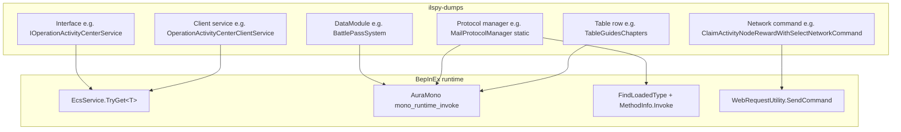

# Game Types, Services, and Class Resolution

Practical guide for finding the **correct type names** in `ilspy-dumps/`, choosing the **right access path** under BepInEx, and reading live game state without crashes.

Companion docs:

| Document | Focus |
|----------|--------|
| [TYPE_RESOLUTION.md](./TYPE_RESOLUTION.md) | `FindLoadedType`, miss cache, shape scans, `GetComponents<T>` inflation |
| [DECOMPILED_SOURCE_MAP.md](./DECOMPILED_SOURCE_MAP.md) | Per-feature type matrix, dump folder layout |
| [GAME_ASSEMBLIES_AND_TOOLS.md](./GAME_ASSEMBLIES_AND_TOOLS.md) | Interop vs Mono vs IL2CPP, regeneration |
| [BACKPACK_AND_ITEMS.md](./BACKPACK_AND_ITEMS.md) | Inventory / `ItemNetPair` / wild gifts |

---

## 1. Type taxonomy (what you are looking for)

Heartopia splits logic across several naming layers. A single feature often touches **three** of them.



| Kind | Typical namespace | Assembly image | How the game uses it | How the mod should access it |
|------|-------------------|----------------|----------------------|------------------------------|
| **Protocol interface** | `XDTDataAndProtocol.ProtocolService.*` | `XDTDataAndProtocol.dll` | `EcsService.TryGet<IService>()` | AuraMono `EcsService.TryGet<T>` (BepInEx) or managed `MakeGenericMethod` if interop loaded |
| **Client service impl** | `ClientSystem.*` | `EcsSystem.dll` | Registered in `EcsInjectOfClient` | Same as interface — resolve **interface** for `TryGet`, impl class for method names |
| **Network command** | `XDT.Scene.Shared.Modules.*` | `EcsClient.dll` | `WebRequestUtility.SendCommand(cmd)` | `ResolveHomelandFarmManagedType` / `TryHomelandFarmSendCommand` / AuraMono `Activator.CreateInstance` |
| **Protocol manager** | `XDTDataAndProtocol.ProtocolService.*` | `XDTDataAndProtocol.dll` | Static `*ProtocolManager.Method()` | Managed `MethodInfo.Invoke` or AuraMono static invoke |
| **DataModule** | `XDTGameSystem.GameplaySystem.*` | `XDTGameSystem.dll` | `DataModule<T>.Instance` | AuraMono `get_Instance` on module class (`TryGetAuraMonoDataModuleInstance`) |
| **Shared struct / enum** | `XDT.Scene.Shared.Modules.*`, `EcsClient.*` | `EcsClient.dll` | Fields on components, command payloads | AuraMono `TryGetMonoInt32Member`, enum arrays via `mono_array_addr_with_size` |
| **ECS component** | `XDTLevelAndEntity.Gameplay.Component.*` | `XDTLevelAndEntity.dll` | `Entities.GetComponents<T>()` | AuraMono generic `GetComponents` inflation (see TYPE_RESOLUTION.md) |
| **Table data** | global `Table*` classes | `EcsClient.dll` | `TableData.TableGuidesChapterss`, `GetBattlePassPeriod` | AuraMono static invoke on `TableData` |

**Rule:** UI code in dumps is the best hint for *which* API to call. Search the panel name (e.g. `TownGuidePanel`, `MiniBattlePassPanelGift`) and copy the exact `DataModule<>` / `EcsService.TryGet<>` / `*ProtocolManager` call.

---

## 2. Where services actually live (not `Managers._serviceDic`)

A common mistake is scanning `XDTGame.Framework.Managers.Instance._serviceDic` for gameplay services.

On this build, client services are registered through **ECS inject**:

```csharp
// ilspy-dumps/EcsSystem/.../EcsInjectOfClient.cs
builder.Inject<OperationActivityCenterClientService>();
builder.Inject<TownGuidesClientService>();
builder.Inject<MailServiceClient>();
builder.Inject<BattlePassClientService>();
// ...
```

`EcsInjectSystem` calls `EcsService.SetServiceProvider(this)`. Runtime lookup:

```csharp
// ilspy-dumps/XDTDataAndProtocol/.../EcsService.cs
public static bool TryGet<T>(out T service, bool isLogError = true) where T : class
{
    if (_serviceProvider == null) { service = null; return false; }
    service = GetProviderService<T>();  // cached in EcsCacheService<T>._instance
    return service != null;
}
```

| Wrong path | Why it fails |
|------------|--------------|
| `Managers._serviceDic` | Holds **module** wrappers (`ModuleObject`), not `IOperationActivityCenterService` / `ITownGuidesService` |
| `FindLoadedType("EcsService")` only | Interop often missing; type is `null` even when AuraMono has the class |
| Short name `IOperationActivityCenterService` | Ambiguous; always use **full namespace** from dump |

**Correct path (BepInEx):** AuraMono class for `XDTDataAndProtocol.ProtocolService.EcsService` → inflate `TryGet<T>` → invoke with service **interface or impl** as `T`.

Reference implementation: `buddy/DailyClaimsFeature.cs` — `TryDailyClaimsAuraMonoEcsTryGet`, `TryDailyClaimsResolveServiceViaAuraMonoEcs`.

---

## 3. Finding the correct full type name

### 3.1 Workflow

1. Open **`ilspy-dumps/`** (Mono PE — full method bodies). Do **not** use `gameassembly-dumps/` for `EcsClient` / protocol types.
2. Find the **UI panel** or **protocol manager** that performs the action.
3. Copy **interface** + **client service** + **command struct** names verbatim.
4. Note the **assembly** from the dump path (`EcsSystem`, `EcsClient`, `XDTDataAndProtocol`, `XDTGameSystem`).
5. Pass **multiple aliases** to resolvers (`Gameplay` vs `GamePlay`, `EcsClient.` prefix on commands, `Il2Cpp` interop prefix).

### 3.2 Daily Claims reference table (verified build)

| Feature | Read state | Claim action |
|---------|------------|--------------|
| Sign-in / activity nodes | `IOperationActivityCenterService.GetAliveActivityIds()` + `GetActivityNodeStateById(id)` | `OperationActivityProtocolMananger.ReceiveReward` or `SendCommand(ClaimActivityNodeRewardWithSelectNetworkCommand)` |
| Town guide | `ITownGuidesService.GetAllChapterInfo(List<GuidesChapterInfo>)` | `TownGuidesProtocolManager.GetNodeReward` / `GetChapterReward` or `SendCommand(GetNodeRewardCommand)` |
| Mail | `IMailClientService.IsAnyRewardable()` / `GetMails()` + `IsMailRewardable(mail)` | `MailProtocolManager.RequestAllRewards` |
| Mini BP | `BattlePassSystem.GetFreeBattlePassSlots()` / `GetPayBattlePassSlots()` — count `BattlePassSlot.state == CanGet` | `BattlePassProtocolManager.GetAllRewards` |
| BP loop | `BattlePassSystem.GetBattlePassData()` → `curExp`, `level`; `TableData.GetBattlePassPeriod(id).CycleRewardNeedPoint` | `BattlePassProtocolManager.GetLoopRewards` |

**Exact types:**

| Role | Full name |
|------|-----------|
| Activity interface | `XDTDataAndProtocol.ProtocolService.OperationActivity.IOperationActivityCenterService` |
| Activity impl | `ClientSystem.OperationActivityCenter.OperationActivityCenterClientService` |
| Town guide interface | `XDTDataAndProtocol.ProtocolService.TownGuides.ITownGuidesService` |
| Town guide impl | `ClientSystem.TownGuides.TownGuidesClientService` |
| Mail interface | `XDTDataAndProtocol.ProtocolService.Mail.IMailClientService` |
| Mail impl | `ClientSystem.Mail.MailServiceClient` |
| BP module | `XDTGameSystem.GameplaySystem.BattlePass.BattlePassSystem` |
| BP client service | `ClientSystem.BattlePass.BattlePassClientService` |
| Service locator | `XDTDataAndProtocol.ProtocolService.EcsService` |
| Activity node enum | `XDT.Scene.Shared.Modules.OperationActivityCenter.ActivityNodeState` (`Lock=0, Unlock=1, WaitClaim=2, Finished=3`) |
| Town guide chapter struct | `XDT.Scene.Shared.Modules.TownGuides.GuidesChapterInfo` |
| BP slot enum | `XDTGameSystem.GameplaySystem.BattlePass.BattlePassSlotEnum` (`Got=0, CanGet=1, CanNotGet=2, Lock=3`) |

Dump paths:

```
ilspy-dumps/XDTDataAndProtocol/.../IOperationActivityCenterService.cs
ilspy-dumps/EcsSystem/ClientSystem.OperationActivityCenter/OperationActivityCenterClientService.cs
ilspy-dumps/EcsSystem/ClientSystem.TownGuides/TownGuidesClientService.cs
ilspy-dumps/XDTGameSystem/.../BattlePassSystem.cs
```

---

## 4. AuraMono class lookup (`FindAuraMonoClassByFullName`)

**Location:** `HeartopiaComplete.FindAuraMonoClassByFullName` / `FindAuraMonoClassInLikelyImages`.

Resolution order:

1. Split full name → `namespace` + `className`.
2. `mono_class_from_name` in **likely images** for that namespace (see table below).
3. Fallback: `FindAuraMonoClassAcrossLoadedAssemblies(namespace, className)`.

### Namespace → Mono image

| Namespace prefix | Images tried (first hit wins) |
|------------------|-------------------------------|
| `XDTDataAndProtocol.*` | `XDTDataAndProtocol.dll`, `Client.dll` |
| `ClientSystem.*` | `EcsSystem.dll`, `Client.dll`, `XDTDataAndProtocol.dll` |
| `EcsClient.*` / `XDT.Scene.*` | `EcsClient.dll`, `Client.dll` |
| `XDTGameSystem.*` | `XDTGameSystem.dll`, `Client.dll` |
| `XDTLevelAndEntity.*` | `XDTLevelAndEntity.dll`, `Client.dll` |
| `XDTGame.UI.*` | `XDTGameUI.dll`, `Client.dll` |
| *(default)* | All major `XDT*`, `EcsClient`, `Client`, `Assembly-CSharp` |

> **⚠ First-image-only:** `FindAuraMonoClassInLikelyImages` resolves the image list via `FindAuraMonoImage(list)`, which returns the **first loaded image** — `mono_class_from_name` is then tried on that single image only. If the namespace is unmapped (falls into the *default* row) and the type's real assembly is not the first loaded entry, the lookup fails even though the class exists. Verified case: `XDTGUI.Module.Build.BuildModule` — the namespace suggests UI, but the class is compiled into **XDTLevelAndEntity** (namespace ≠ assembly); the default list starts with `XDTGameUI`, so `FindAuraMonoClassByFullName` never finds it. **Fix:** call `FindAuraMonoClassInImages(ns, name, imageNames)` directly — it probes *every* image in the list. Confirm the real assembly by the dump path (`ilspy-dumps/<assembly>/<namespace>/<Type>.cs`).

**Global-namespace tables** (`TableData`, `TableGuidesChapters`): use `FindAuraMonoClassAcrossLoadedAssemblies(string.Empty, "TableData")`.

Methods: `FindAuraMonoMethodOnHierarchy(class, methodName, paramCount)` walks base types; **paramCount must match exactly** (includes `ref`/`out` as parameters).

### Module instances (`Module` / `ViewModule`) via `Managers.GetModule(Type)`

`BagModule`, `BuildModule`, `UICacheModule`, … are instances owned by `XDTGame.Framework.Managers`
(assembly **XDTBaseService**), stored in `_moduleDic` — a `Dictionary<Type, ModuleObject>` whose
values are **wrappers** (the module is `wrapper.module`). Resolve instances through `GetModule`,
never by scanning the dictionary:

- **Managed tier:** `FindLoadedType(fullName)` + `TryGetManagedModule(type, out obj)` (non-generic
  `Managers.GetModule(Type)` via `MethodInfo`; fallback reads `_moduleDic` as a managed
  `IDictionary`). Works when interop has a stub (`BagModule` / DirectBackpack); returns null when it
  doesn't (`BuildModule` on the current build).
- **AuraMono tier:** class via `FindAuraMonoClassInImages` (see warning above) →
  `mono_class_get_type` + `mono_type_get_object` → invoke `internal static GetModule(Type)` on the
  `Managers` class **pinned to `XDTGame.Framework` in the `XDTBaseService` image** (an unqualified
  `"Managers"` lookup can land on an unrelated class with an empty `_moduleDic`).
- **Never:** `Type.GetType(string)` through `mono_runtime_invoke` (hard native crash,
  `icall.c:1622 internal_from_name`), or enumerating `_moduleDic.Values` via AuraMono
  (`Dictionary` ValueCollection enumerates to 0 through the boxed struct-enumerator path).

Worked example with code: [TYPE_RESOLUTION.md → Resolving module instances](./TYPE_RESOLUTION.md#resolving-module-instances-managersgetmodule--worked-example-buildmodule). Consumer: `PadBuildHotkeyFeature.cs` (Pad build hotkeys).

---

## 5. `EcsService.TryGet<T>` via AuraMono (generic inflation)

Managed `EcsService.TryGet` via `FindLoadedType` + `MakeGenericMethod` often returns **false** under BepInEx because interop never loaded `XDTDataAndProtocol.ProtocolService.EcsService`.

Working approach (same building blocks as `GetComponents<T>` — see [TYPE_RESOLUTION.md § AuraMono generic](./TYPE_RESOLUTION.md#auramono-generic-getcomponentst-direct-ecs-query)):

```
1. FindAuraMonoClassByFullName("XDTDataAndProtocol.ProtocolService.EcsService")
2. FindAuraMonoMethodOnHierarchy(ecsClass, "TryGet", 2)
      // bool TryGet<T>(out T service, bool isLogError)
3. mono_class_get_type(serviceClass) → MonoType*
4. mono_metadata_get_generic_inst(1, &serviceType) → MonoGenericInst*
5. mono_class_inflate_generic_method(openTryGet, { method_inst = genericInst })
6. mono_compile_method(inflated)
7. mono_runtime_invoke:
      args[0] = pointer to IntPtr slot (out T)   // List** pattern — NOT the object itself
      args[1] = pointer to bool logError (int 0/1)
8. service = slot[0]; success when non-zero
```

**`T` candidates:** try **interface first**, then **client service impl**:

```csharp
"XDTDataAndProtocol.ProtocolService.OperationActivity.IOperationActivityCenterService"
"ClientSystem.OperationActivityCenter.OperationActivityCenterClientService"
```

Cache inflated methods per `serviceClass` `IntPtr` — inflation is expensive.

---

## 6. `DataModule<T>.Instance` (gameplay modules)

UI uses `DataModule<BattlePassSystem>.Instance`. Under BepInEx the module class is usually reachable only via AuraMono:

```csharp
IntPtr bpClass = FindAuraMonoClassByFullName(
    "XDTGameSystem.GameplaySystem.BattlePass.BattlePassSystem");
IntPtr instance = TryGetAuraMonoDataModuleInstance(bpClass);
// invokes static get_Instance on the module type
```

Then instance methods via `mono_runtime_invoke`:

| Method | Returns | Use |
|--------|---------|-----|
| `GetBattlePassData()` | `PlayerBattlePassComponent` struct | `curExp`, `level`, `curPeriodId`, `cycleRewardNum` |
| `GetBpMaxLevel()` | `int` | BP loop red-point logic |
| `GetFreeBattlePassSlots()` | `List<BattlePassSlot>` | Count `state == 1` (`CanGet`) |
| `GetPayBattlePassSlots()` | `List<BattlePassSlot>` | Paid track rewards |

`FindLoadedType("BattlePassSystem")` may work in some sessions but **AuraMono `get_Instance` is the reliable path** on the current build.

---

## 7. Protocol managers and `SendCommand`

### 7.1 Static protocol invoke

Pattern from `DailyClaimsFeature.TryInvokeDailyClaimsProtocol`:

1. `ResolveHomelandFarmManagedType(shortName, fullTypeName)` → managed `Type` (optional).
2. `FindAuraMonoClassByFullName(fullTypeName)` → `IntPtr` class.
3. `FindAuraMonoMethodOnHierarchy(class, methodName, paramCount)`.
4. `mono_runtime_invoke(method, null, args)` for static methods.

Example managers:

| Manager | Claim method |
|---------|--------------|
| `XDTDataAndProtocol.ProtocolService.Mail.MailProtocolManager` | `RequestAllRewards()` |
| `XDTDataAndProtocol.ProtocolService.BattlePass.BattlePassProtocolManager` | `GetAllRewards()`, `GetLoopRewards()` |
| `XDTDataAndProtocol.ProtocolService.OperationActivity.OperationActivityProtocolMananger` | `ReceiveReward(activityId, nodeIndex, selectIndex)` |
| `XDTDataAndProtocol.ProtocolService.TownGuides.TownGuidesProtocolManager` | `GetNodeReward`, `GetChapterReward` |

Note the typo **`OperationActivityProtocolMananger`** (missing **e**) — must match dump exactly.

### 7.2 `SendCommand` fallback

When protocol types are missing from interop, create command structs and send:

```csharp
TryHomelandFarmSendCommand(commandType, cmd => {
    TrySetObjectMember(cmd, "ActivityId", activityId);
    // ...
}, out status);
```

Command types live under `XDT.Scene.Shared.Modules.*` in **`EcsClient.dll`**. Always add `EcsClient.` prefixed alias.

---

## 8. Reading AuraMono return values

### 8.1 Enum arrays (`ActivityNodeState[]`)

`GetActivityNodeStateById` returns `ActivityNodeState[]`. Empty array is **valid** (activity exists but has no `OperationActivityNodeStateComponent`).

```csharp
// After invoke returns arrayObj:
int count = mono_array_length(arrayObj);
IntPtr base = mono_array_addr_with_size(arrayObj, 4, 0);  // enums are int32 in array
for (int i = 0; i < count; i++)
    int value = Marshal.ReadInt32(base, i * 4);
```

Do **not** treat `count == 0` as read failure.

### 8.2 Generic `List<T>` for structs (`List<GuidesChapterInfo>`)

`GetAllChapterInfo(List<GuidesChapterInfo> chapterInfos)` — **out parameter is the list object**:

1. Create list: `Type.GetType("System.Collections.Generic.List`1[[...GuidesChapterInfo, EcsClient]]")` + `Activator.CreateInstance` via AuraMono.
2. Pass `listObj` as `args[0]` to `GetAllChapterInfo`.
3. `TryEnumerateAuraMonoCollectionItems(listObj, items)` — each item may be a **boxed struct**.
4. Read fields: `ChapterId`, `State` (enum as int), `AllNodes` (nested list).

**Do not** iterate `chapterId = 1..128` with `GetChapterInfo` — ids not in `TableGuidesChapterss` return `default` (`ChapterId=0`).

### 8.3 Bool / int returns

Unbox with `TryUnboxMonoBoolean` / `TryUnboxMonoInt32` (`AuraFarm.cs`). Boxed return from `IsAnyRewardable()`, `GetBpMaxLevel()`, etc.

### 8.4 `ref` / `out` parameters

| Parameter | `mono_runtime_invoke` arg |
|-----------|---------------------------|
| `ref List<T> list` | `IntPtr*` to `IntPtr` slot holding list object |
| `out T service` | same pointer-to-pointer pattern |
| `bool isLogError` | `int*` on stack (0 or 1) |
| `int activityId` | `int*` on stack |

Wrong convention → native AV or `icall.c:1622` in console (sometimes non-fatal).

---

## 9. Managed-first, AuraMono-fallback policy

Used consistently across Homeland Farm, Daily Claims, Daily Quest submit:

```
1. TryEnsureHomelandFarmInteropAssembliesLoaded()  // clears miss cache on success
2. FindLoadedType / ResolveHomelandFarmManagedType
3. MethodInfo.Invoke / EcsService.MakeGenericMethod.TryGet
4. If null → EnsureAuraMonoApiReady() + AttachAuraMonoThread()
5. FindAuraMonoClassByFullName → mono_runtime_invoke
```

Log **which tier succeeded** in feature logs (`source=AuraMono EcsService.TryGet: …` vs `managed ok`).

---

## 10. Interop bootstrap

`TryEnsureHomelandFarmInteropAssembliesLoaded()` loads game assemblies from `BepInEx/interop/` into the `AppDomain` so `FindLoadedType` can succeed mid-session. Call from feature `Ensure*ReflectionReady()` before type scans.

Even after interop load, many types remain **AuraMono-only**. Do not assume interop load fixes all resolution.

---

## 11. Diagnostics checklist

When a feature logs `unavailable` / `null` / `count=0` unexpectedly:

| Check | Action |
|-------|--------|
| In world? | Enter town; many assemblies load only after world sync |
| Correct dump folder? | `ilspy-dumps` for `EcsClient` / `ClientSystem`, not `gameassembly-dumps` |
| Full namespace? | Copy from dump, not guessed short name |
| Wrong service bucket? | Use `EcsService.TryGet`, not `Managers._serviceDic` |
| `TryGet` param count | `TryGet` = **2** params (`out T`, `bool`) |
| Empty array vs error | `Array.Empty<ActivityNodeState>()` is success with 0 nodes |
| Table field missing | `cycleNeed=0` → `TableData.GetBattlePassPeriod` AuraMono path failed |
| `icall.c:1622` in console | Often non-fatal; distinguish from AV crash (see TYPE_RESOLUTION.md) |
| Probe once | Log `auraEcsClass`, `auraTryGet`, `managedEcsType` (DailyClaims probe pattern) |

---

## 12. Log All State — expected log lines

`DailyClaimsFeature` **Log All State** button (`buddy/DailyClaimsFeature.cs`):

| Log prefix | Meaning |
|------------|---------|
| `Sign-in: activities=N waitClaimNodes=M` | `M` = nodes in `WaitClaim` across all activities |
| `activityId=X [i:WaitClaim, …]` | Per-activity node states |
| `activityId=X nodes=0` | Alive activity without node-state component (not sign-in) |
| `Town guide: nodeReward=N chapterReward=M` | Chapters/nodes in `Reward` enum state |
| `Mail: rewardable=… count=…` | `IMailClientService.IsAnyRewardable` + per-mail count |
| `Mini BP: freeCanGet=N paidCanGet=M` | `BattlePassSlotEnum.CanGet` slot counts |
| `BP Loop: claimable=… cycles=…` | `curExp / CycleRewardNeedPoint`; `redPoint` = max level + threshold |
| `State: signIn wait=… town ch=… mail=… miniBp=… bpLoop=…` | UI status line summary |

---

## 13. Related source files

| File | Responsibility |
|------|----------------|
| `buddy/DailyClaimsFeature.cs` | EcsService.TryGet inflation, town guide list, mail/BP state probes |
| `buddy/HeartopiaComplete.cs` | `FindLoadedType`, `FindAuraMonoClassByFullName`, `TryGetAuraMonoDataModuleInstance` |
| `buddy/HomelandFarmFeature.cs` | `ResolveHomelandFarmManagedType`, `TryHomelandFarmSendCommand`, interop load |
| `buddy/AuraFarm.cs` | Mono exports, `TryUnboxMonoBoolean`, generic inflation primitives |
| `buddy/DailyQuestSubmitFeature.cs` | `List<ItemNetPair>` AuraMono create + fill pattern |
| `buddy/WildAnimalGiftFeature.cs` | AuraMono-only protocol (`WildAnimalProtocolManager`) — no `EcsService` |
| `buddy/PadBuildHotkeyFeature.cs` | Module-instance resolve reference: managed `TryGetManagedModule` → AuraMono `Managers.GetModule(Type)` → UI fallback |

---

## 14. After a game patch

1. Regenerate `ilspy-dumps/` if assemblies changed.
2. Re-open affected UI panel `.cs` — verify interface/method names.
3. Check `EcsInjectOfClient.cs` for renamed services.
4. Rebuild interop (`BUILD_AND_RUN.md`), rebuild mod.
5. Run **Log All State** in town; compare to §12.
6. Update this table if namespaces shifted.
