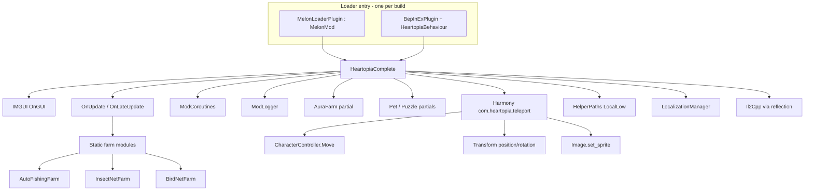

# Technical Architecture

Deep technical reference for **Heartopia Helper**. For maintainers updating after game patches or extending features.

---

## High-Level Architecture



### Design pattern

- **Dual-loader build:** Same sources, `-p:Loader=MelonLoader|BepInEx`, conditional compilation (`MELONLOADER` / `BEPINEX`).
- **Loader-agnostic core:** `HeartopiaComplete` is a plain class; plugins forward lifecycle hooks.
- **Shared abstractions:** `ModLogger` / `ModCoroutines` hide loader-specific APIs.
- **Monolithic core:** ~59,000 lines in `HeartopiaComplete.cs`.
- **Partial classes:** Farms and features split across files, merged at compile time.
- **Static farm controllers:** Ticked from `HeartopiaComplete.OnUpdate`.
- **Runtime reflection:** Game types resolved by name after load.

---

## Entry Point and Lifecycle

### MelonLoader (`MelonLoaderPlugin.cs`)

```csharp
#if MELONLOADER
[assembly: MelonInfo(typeof(HeartopiaMelonPlugin), "Heartopia Helper", "1.0.0", "HeartopiaMod")]
public class HeartopiaMelonPlugin : MelonMod
{
    private HeartopiaComplete _mod;
    public override void OnInitializeMelon() { _mod = new HeartopiaComplete(); _mod.OnInitializeMelon(); }
    public override void OnUpdate() => _mod?.OnUpdate();
    // OnLateUpdate, OnGUI, OnDeinitializeMelon ...
}
#endif
```

### BepInEx (`BepInExPlugin.cs`)

```csharp
#if BEPINEX
[BepInPlugin(...)]
public class HeartopiaBepInPlugin : BasePlugin
{
    public override void Load()
    {
        ModLogger.Init(Log);
        AddComponent<HeartopiaBehaviour>();  // survives scene cleanup
    }
}

public class HeartopiaBehaviour : MonoBehaviour
{
    private void Awake()
    {
        ModCoroutines.SetHost(this);
        _mod = new HeartopiaComplete();
        _mod.OnInitializeMelon();
    }
    // Update, LateUpdate, OnGUI, OnDestroy → _mod hooks
}
#endif
```

### `HeartopiaComplete`

```csharp
public partial class HeartopiaComplete  // NOT MelonMod
{
    public void OnInitializeMelon() { ... }
    public void OnUpdate() { ... }
    public void OnLateUpdate() { ... }
    public void OnGUI() { ... }
    public void OnDeinitializeMelon() { ... }
}
```

### `OnInitializeMelon` sequence

1. `ApplyMasterConsoleVisibility()` (MelonLoader console hide flag).
2. `Instance = this`.
3. `harmonyInstance = new Harmony("com.heartopia.teleport")`.
4. Load config: localization, radar icons, teleports, keybinds, theme, patrols, radar, bird farm.
5. Apply Harmony patches (manual `Patch()` calls).
6. Log legacy auto-fish disabled message.
7. `ModCoroutines.Start(NetCookCoroutineWarmupRoutine())`.

### Logging (`ModLogger.cs`)

| Loader | Output |
|--------|--------|
| MelonLoader | `MelonLogger.Msg` / `Warning` |
| BepInEx | BepInEx log + append `{Game}/UserData/helper.log` |

All mod code uses `ModLogger.Msg(...)` — never call loader APIs directly.

### Coroutines (`ModCoroutines.cs`)

| Loader | Backend |
|--------|---------|
| MelonLoader | `MelonCoroutines.Start/Stop` |
| BepInEx | `MonoBehaviour.StartCoroutine` on `HeartopiaBehaviour` via `WrapToIl2Cpp()` |

BepInEx requires `ModCoroutines.SetHost(this)` in `HeartopiaBehaviour.Awake` before any `Start()` call.

### Frame loops

| Callback | Responsibilities |
|----------|------------------|
| `OnUpdate` | Hotkeys, farms (`AutoFishingFarm.Update`, insect/bird ticks), aura farm, auto eat/repair triggers, noclip movement, game speed, pet play tick, puzzle tick, radar refresh, bag automation state machines |
| `OnLateUpdate` | Mouse-look camera, position monitor debug, camera override frames, custom FOV |
| `OnGUI` | Full mod menu, radar overlay, resource ESP, notifications, status overlay |

---

## Harmony Patches

### Active at runtime (registered in `OnInitializeMelon`)

| Patch class | Target | Type | Purpose |
|-------------|--------|------|---------|
| `CharacterControllerPatch` | `CharacterController.Move` | Prefix | When `OverridePlayerPosition`, replaces motion with delta to override pos; when blocking input, zero motion |
| `TransformPositionPatch` | `Transform.position` setter | Prefix | Blocks or redirects unauthorized position writes during teleport/noclip |
| `TransformRotationPatch` | `Transform.rotation` setter | Prefix | Guards rotation during controlled movement |
| `CharacterRotationPatch` | `Transform.rotation` setter | Prefix | Additional character-specific rotation guard (second patch on same setter) |
| `SpriteDetectionPatch` | `UI.Image.sprite` setter | Postfix | Bulk selector live item discovery |

Patches are applied with explicit `MethodInfo` lookup — failures log `[ERR]` with null method diagnostics.

### Compiled but **not** registered

These files are in `buddy.csproj` but **`OnInitializeMelon` never calls the `patchInputPostfix` helper** (lambda is defined then discarded):

- `InputGetKeyDownPatch.cs`
- `InputGetKeyPatch.cs`
- `InputGetKeyUpPatch.cs`
- `InputGetKeyDownStringPatch.cs`
- `InputGetKeyStringPatch.cs`
- `InputGetKeyUpStringPatch.cs`

They would inject `HeartopiaComplete.SimulateFKeyDown/Hold/Up` into Unity `Input` queries.

**Impact:** Code that sets `SimulateFKey*` static flags only works if patches are registered. **`AutoFishingFarm` does not rely on this** — it calls `TrySetFishingPressed` on game fishing APIs. Legacy `AutoFishLogic` (orphan) did rely on Input simulation.

### Orphan Harmony patches (not in csproj)

All `AutoFishGet*.cs` files patch `Input` for mouse, axes, W/A/S/D — tied to orphan `AutoFishLogic`.

### Dynamic patches

- **Bypass overlap:** `EnsureBypassPatched()` applies building overlap bypass when user enables it (Self → Building).
- **Bird photo runtime:** `EnsureBirdPhotoRuntimeProbePatch()` when bird farm enabled.

---

## Movement and Teleport Model

### Static flags on `HeartopiaComplete`

```csharp
public static bool OverridePlayerPosition;
public static Vector3 OverridePosition;
public static int teleportFramesRemaining;

public static bool OverrideCameraPosition;
public static Vector3 CameraOverridePos;
public static Quaternion CameraOverrideRot;
public static int cameraOverrideFramesRemaining;
```

### Flow

1. Teleport sets player transform position **and** `OverridePosition` + frame count (~10 frames).
2. `CharacterControllerPatch.MovePrefix` steers controller motion toward override each frame.
3. Prevents server/client controller from immediately snapping back.

Noclip uses the same override path with continuous position updates from WASD logic in `OnUpdate`.

### Win32 input

For bag automation and some interactions, the mod uses:

- `SendInput`, `keybd_event`, `mouse_event`
- `PostMessage` with `WM_KEYDOWN` / `WM_LBUTTONDOWN` for targeted window messages
- `VK_F` (0x46) for interact key simulation where UI paths are unavailable

Separate from Harmony Input patches.

---

## Auto Fishing (`AutoFishingFarm`)

### Architecture

Static state machine in `AutoFishingFarm.cs`; UI in `DrawSection`; tick via `AutoFishingFarm.Update(HeartopiaComplete host)`.

### Key game integration (on host)

Reflection / Il2Cpp calls on `HeartopiaComplete` (representative):

- Resolve fishing rod tool state
- Find fish shadow entities in range
- `TrySetFishingPressed(bool)` — primary reel/cast control
- Read fishing state enum/strings: `Battle`, `FishingOnHook`, `FishingFail`, `BattleFailSlack`, etc.
- Track bait netId / battle bait for lost-bait recovery

### Reel logic

- Maintains `lastRequestedPressed` vs tension thresholds.
- `BattlePressCooldown` 80 ms between press updates.
- Grace periods: post-hook, post-battle, post-lost-bait, post-cast idle, stale idle.

### Tool management

- Saves `previousToolEquipType` before equipping rod.
- `RestorePreviousTool` on disable.
- Retry equip every 3.25 s if rod missing.

---

## Aura Farm (`AuraFarm.cs` partial)

### Method resolution

`ResolveAuraFarmRuntimeMethods()` scans loaded assemblies matching fragments:

`Assembly-CSharp`, `Il2CppAssembly-CSharp`, `XDT`, `Game`

Excluded: Unity, System, MelonLoader, Harmony, etc.

Caches `MethodInfo` / `FieldInfo` for:

- `SendPickBush`, `SendAttackTree`, `SendHitStone`
- `InteractSystem` instance / player / target list
- `EntityHelper`, `EntityUtil`, `Entities.SphereQueryEntities`
- Collectable / bush / level object components

### Tick

`UpdateAuraFarm()` when enabled:

1. Throttled scan interval 80 ms.
2. Sphere/cylinder overlap queries for resources.
3. Issues server-side pick/attack commands with per-owner cooldown 20 ms.

Failure sets `auraLastError`; UI can surface via status helpers.

---

## Insect / Bird Farms

### Common patterns

Both static modules share design with fishing:

- Enable/disable with tool restore
- Session counters, cooldowns, status strings for overlay
- Config loaded from unified `KeybindConfigData` / `BirdFarmConfigData`

### Insect-specific

- Hard-coded patrol route (50+ `Vector3` waypoints) for empty-area teleport rotation.
- Batch size and scan range from config.
- Recent netId dedup dictionaries.

### Bird-specific

- Multi-catch burst with pending confirmation window (500 ms delay, 8 s timeout).
- `_pendingConfirmNetIds` tracks server ACKs.
- Safety stop, stationary throttle, runtime recycle every 180 s.
- Crash trace log path:
  - MelonLoader: `{Game}/MelonLoader/Logs/birdfarm-crashtrace.log`
  - BepInEx: `{Game}/BepInEx/birdfarm-crashtrace.log`

---

## Radar System

### Scanner

Periodic world scan builds hierarchy under internal `radarContainer` GameObject. Markers created/destroyed as resources spawn/despawn.

### Metadata

`RadarMarkerMetadata` per marker:

- Canonical label, icon key, cooldown flag
- Optional `ResourceVisualEspIconTexture`

### Species icon index

Cached text file: `%LocalLow%/HelperSettings/Cache/radar_species_icons.txt`

### Visual ESP

`HeartopiaResourceVisualEsp.cs`:

- Projects marker world positions to screen
- Sorts by priority (e.g. Bubble first)
- Collision avoidance for label rects (`resourceVisualEspPlacedRects`)
- Styles: beacon glow, card panel, minimal dot

---

## Bulk Selector

`sprite` setter postfix filters sprites containing `ui_item_normal`.

Maps sprite name → list of UI `Transform` slots in `slotCache`.

Enables clicking matching slots without manual item ID entry.

---

## Configuration System

### Primary store

**Path:** `%LocalLow%/HelperSettings/Config.xml`

Despite the `.xml` extension, serialization uses `System.Xml.Serialization.XmlSerializer` on `UnifiedConfigData` — file content is XML.

### `UnifiedConfigData` schema (top level)

| Field | Type | Contents |
|-------|------|----------|
| `Keybinds` | `KeybindConfigData` | All key codes + gameplay tuning floats |
| `UiTheme` | `UiThemeConfigData` | RGB + alpha for UI layers, scale |
| `Radar` | `RadarConfigData` | Marker style, distance, ESP options, priorities |
| `BirdFarm` | `BirdFarmConfigData` | Photo modes, cooldown, scan range, multi-catch |
| `Patrol` | `PatrolData` | Foraging teleport patrol points |
| `TreeFarmPatrol` | `TreeFarmPatrolData` | Chop/mine patrol with rotation |
| `CookingPatrolSaves` | List | Named mass-cook routes |
| `CustomTeleports` | List | User teleport entries |
| `Language` | string | `en`, `es`, `zh-CN`, `pt-BR` |

### `KeybindConfigData` (selected fields)

Integer fields store `(int)KeyCode` values.

Notable floats:

- `noclipSpeed`, `noclipBoostMultiplier`
- `areaLoadDelay`, `resourceTeleportCooldown`, `resourceClickDuration`
- `gameSpeed`, `cameraFOV`, snow/cook intervals
- `autoFish*` tuning (legacy keys still serialized)
- `insect*` tuning
- Auto sell / eat / repair booleans and thresholds

### Secondary / legacy files

| File | Location | Notes |
|------|----------|-------|
| `keybinds.json` | HelperSettings | Legacy; migration reads some lines |
| `ui_theme.json` | HelperSettings | Legacy parallel to unified theme |
| `radar_settings.json` | HelperSettings | Legacy radar |
| `patrol_points.json` | HelperSettings | Foraging patrol |
| `tree_farm_patrol_points.json` | HelperSettings | Tree farm |
| `custom_teleports.json` | HelperSettings | Custom TP list |
| `cooking_patrol_saves/` | HelperSettings directory | Named saves |

`HelperPaths.TryMigrateLegacyUserData(gameBaseDir)` copies `{Game}/UserData/**` → `HelperSettings` once if present.

### Path resolution

Uses Windows known folder GUID `A520A1A4-1780-4FF6-BD18-167343C5AF16` (LocalLow) via `SHGetKnownFolderPath`, with fallback to `%AppData%/LocalLow`.

---

## Localization

`LocalizationManager.cs`:

- Built-in English defaults dictionary (translation keys = English strings).
- External JSON overrides expected at `Localization/*.json` (csproj `CopyToOutputDirectory`) — folder may be empty; defaults still work.
- Languages: en, es, zh-CN, pt-BR.
- `HeartopiaComplete.L("key")` / `LF("format", args)` at UI sites.

---

## Debug ESP

`HeartopiaDebugEsp.cs`:

- Gated by owner check (`IsVisualDebugEspOwnerAllowed`) — restricted debug surface.
- Static API: `DebugEspUpsert`, `DebugEspTrack`, `DebugEspRemove`, `DebugEspClearGroup`.
- Used by internal features for visualizing scan targets (not end-user menu by default).

---

## Il2Cpp Interop Notes

- References `Il2CppInterop.Runtime` for Il2Cpp arrays/types where needed.
- Aliases in `HeartopiaComplete.cs`: `Il2CppType`, `Il2CppMethodInfo`, etc.
- Game objects often accessed via `GameObject.Find` with full hierarchy paths — fragile across patches.
- Player object frequently resolved as `p_player_skeleton(Clone)`.

---

## UI Implementation

- Custom IMGUI skin generated at runtime (`DrawExentriSectionPanel`, accent sliders, switch toggles).
- Theme colors stored as float RGB + alpha; HSV picker generates textures cached in `themeTextures`.
- Menu blocks game UI optionally via `ShouldBlockGameplayInput()` feeding movement patch.
- Scroll views compute dynamic content height per tab/sub-tab.

---

## Coroutines

All async flows use **`ModCoroutines.Start/Stop`**:

- Mass cook patrol
- Bag open/use/close sequences
- Pet feed/play routines
- Net cook warmup
- Teleport-farm flows
- Puzzle solve routine

Loader-specific implementation is hidden in `ModCoroutines.cs`.

---

## Embedded Assets

| Asset | Use |
|-------|-----|
| `Assets/tree.png` | Radar / ESP tree marker |
| `Assets/rare_tree.png` | Rare tree marker |

Loaded from manifest resources at runtime.

---

## Orphan / Legacy Files (not compiled)

These exist under `buddy/` but are **excluded** from `buddy.csproj` (`EnableDefaultCompileItems=false`):

```
AutoFishLogic.cs, AutoFishFarm.cs, AutoFishGet*.cs   Legacy fishing
InsectFarm.cs                                         Pre-InsectNetFarm
MonoEcsCapture.cs, MonoEcsLoadHook.cs, RuntimeDump.cs Experimental dump tooling
FishingAutoDump.cs                                    (if present) debug capture
```

Extended fishing debug / ECS work may live on the **`test`** git branch.

---

## Build System Summary

| Property | Value |
|----------|-------|
| SDK | `Microsoft.NET.Sdk` |
| TFM | `net6.0`, x64 |
| Assembly | `helper.dll` |
| Output | `bin/<Loader>/<Configuration>/` |
| Script | `build-all.bat` |
| Config | `Directory.Build.props` → `HeartopiaDir` |

---

## Known Quirks

| Topic | Detail |
|-------|--------|
| Startup log | `AutoFish subsystem disabled` refers to legacy `AutoFishLogic`, not `AutoFishingFarm` |
| Input Harmony patches | Compiled but not registered at runtime |
| Plugin version | Metadata `1.0.0` may differ from git release tag |
| One loader only | Do not run MelonLoader + BepInEx on the same install |

---

## Updating After Game Patches

Recommended workflow:

1. Launch game with your loader; check which Harmony patches fail.
2. Regenerate interop (MelonLoader Il2CppAssemblies or BepInEx interop) after game updates.
3. Rebuild both targets: `build-all.bat` or `-p:Loader=...` for the loader you use.
4. For aura/fish/insect/bird: enable `MasterLog*` flags, fix reflection type names if needed.
5. For bag/UI automation: verify UI hierarchy paths still exist.
6. Test in a private town, one feature at a time.

---

## Security / Stability Considerations

- Reflection invokes private game methods — can throw if signatures change; most paths wrapped in try/catch with status string fallback.
- Bird farm includes intentional GC pressure reduction (reused lists) after crash investigations.
- `AllowUnsafeBlocks` enabled in csproj (unsafe code may exist in partial classes).
- No network encryption bypass — mod operates as client automation layer.

---

## Related Documentation

- [BUILD_AND_RUN.md](./BUILD_AND_RUN.md)
- [FEATURES.md](./FEATURES.md)
